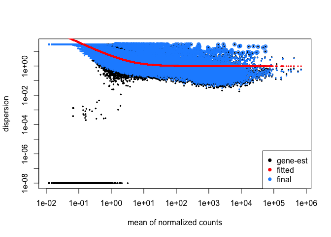
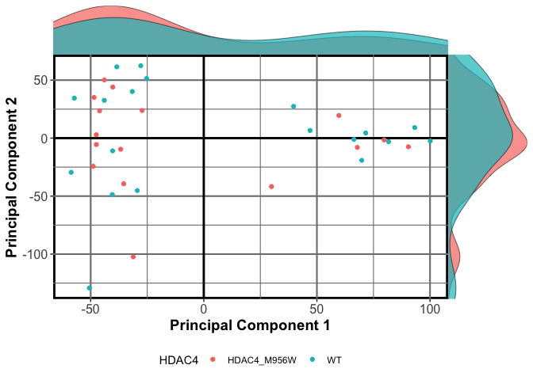
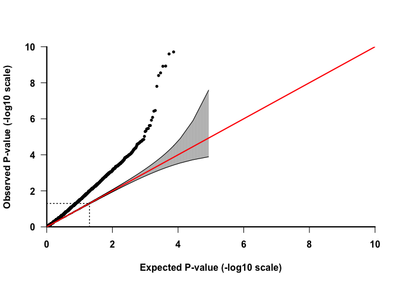
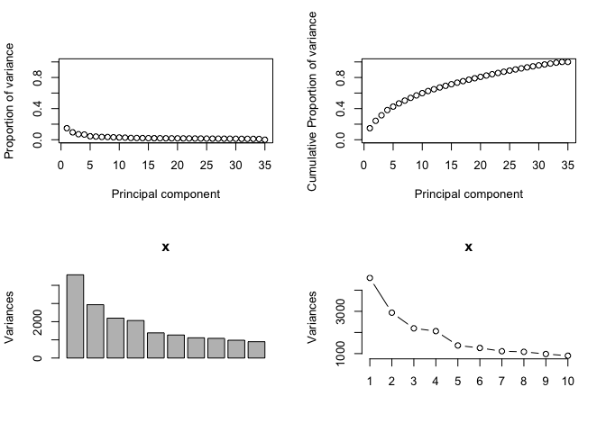
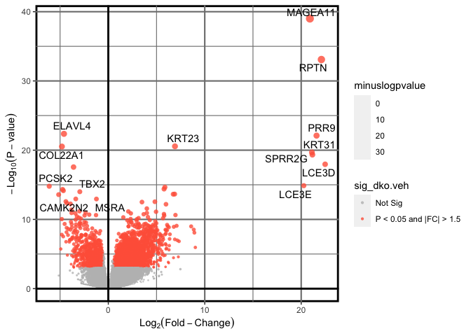

**Code Author**: Mark E. Pepin MD, PhD

**Contact**: [pepinme\@gmail.com](mailto:pepinme@gmail.com){.email}

**Institution**: Heidelberg University Hospital

**Location**: 669 Neuenheimer Feld, Institute for Experimental
Cardiology, 69120 Heidelberg, Germany

# Preliminary Setup

## Converting .bam to count

```r
#### for i in */*bam; do bedtools multicov -bams $i /data/reference/bedfiles/bed1.bed > /data/results/test/$(basename $i); done
```

## Packages


```r
if (!require("pacman")) install.packages("pacman")
pacman::p_load(dplyr, Hmisc, openxlsx, corrplot, RColorBrewer, kableExtra, ggplot2, gridExtra, ggpubr, ggsignif, DESeq2, data.table, GenomicFeatures, biomaRt, Haplin, pheatmap, calibrate, ggrepel, tidyr, gtools, rlist, limma, wesanderson,plotly)
```

## Parameters

Define the parameters used, along with the conditions required for the
current analysis. This segment must be modified for each analysis
performed.


```r
start_t<-Sys.time()
##Set the experimental conditions [MUST DO THIS MANUALLY]
INVEST=c("Hari") # "Shanmukha"
GENOTYPE=c("WT", "HDAC4_M902H") # , "HDAC4_M956W"
TISSUE=c("ALL")
SEX=c("M", "F")
GROUP=GENOTYPE
# OUTLIER=c("676")
STATISTIC = 0.05 #P statistic threshold used in this combination.
# Set the "variable" that determines differential expression
VARIABLE = GENOTYPE
COMPARISON= paste0(TISSUE[1],"_",GENOTYPE[1], "_",VARIABLE[2], ".vs.", VARIABLE[1])
colData_all <- openxlsx::read.xlsx("../1_Input/colData.xlsx")
colDataInvest<-colData_all # %>% subset(Tissue %in% TISSUE)
# Create Output Folder Structure
ifelse(!dir.exists(file.path(paste0("../2_Output/"))), dir.create(file.path(paste0("../2_Output/"))), FALSE)
```

```
## [1] FALSE
```

# RNA-Sequencing Analysis

## RNA-Sequencing Alignment using STAR (STAR/2.7.1a-foss-2018b)

RNA was isolated from the left ventricle endocardial tissue using the
RNeasy Lipid Mini-Kit according to the manufacturer's instructions
(Qiagen, Valencia, CA). High-throughput RNA sequencing was performed at
BGI (Hong Kong, CN). Once sample read quality was checked (FastQC -\>
multiQC analysis), the paired-end fastq files were then aligned to the
reference genome, which was created using Gencode mouse sequence
(GRCm38.primary_assembly.genome.fa) and annotation
(gencode.vM25.primary_assembly.annotation.gtf). STAR aligner
(STAR/2.7.1a-foss-2018b) is the current gold-standard for this, which we
used for the current analysis. Before aligning each fastq file to the
genome, an annotated reference genome must first be assembled. This was
performed as follows (this was performed in Cheaha as \`bash
GenomeReference.sh':

rclone Philip_RNASeq/ gdrive:fasrc/Subfolder --progress


`STAR=../../Tools/STAR-2.5.3a/bin/Linux_x86_64/STAR`

`$STAR \`

`--runThreadN 8 \`

`--runMode genomeGenerate \`

`--genomeDir ./ \`

`--genomeFastaFiles [path-to-"GRCm38.primary_assembly.genome.fa"] \`

`--sjdbOverhang 100 \`

`--sjdbGTFfile ${GTF} \`

Alignment of short reads to this annotated genome could then proceed,
using the following SLURM batch script which was submitted to the UAB
*Cheaha* compute cluster (See **Attached Shell script**). This shell
script contains the following STAR alignment run settings:

`$STAR_RUN \`

`--genomeDir $GENOME_DIR \`

`--readFilesCommand zcat \`

`--readFilesIn $INPUT_DIR/fastq/${VAR}_1.fastq.gz $INPUT_DIR/fastq/${VAR}_2.fastq.gz \`

`--sjdbGTFfile $GENOME_DIR/gencode.vM25.chr_patch_hapl_scaff.annotation.gtf  \`

`--quantMode GeneCounts \`

`--runThreadN 12 \`

`--outSAMtype BAM SortedByCoordinate \`

`--outFileNamePrefix ${RESULTS_DIR}/Alignment/${VAR}_`

## Read Count Compiling

Before the DESeq2-based differential expression can be computed, the
counts generated by STAR need to be compiled, since the .tab file
contains count information based on forward, reverse, and combined
reads. Therefore, we will take the fourth column in each table and merge
them.


```r
Count.files <- list.files(path = "../1_Input/Counts/", pattern = "*.rna_seq.augmented_star_gene_counts.tsv", full.names = TRUE, all.files = TRUE)
Counts <- lapply(Count.files, read.table, skip = 6) #skip the first 4 rows, since these are summary data.
#Create a data.frame containing the raw counts
countData.raw <- as.data.frame(sapply(Counts, function(x) x[,4])) #selects only the 4th column raw counts.
#Generate Column names and Row names for the counts (remove the extra nonsense from the path names)
colnames <- gsub( ".rna_seq.augmented_star_gene_counts.tsv", "", Count.files)
colnames <- gsub( "[.][.]/1_Input/Counts//", "", colnames)
colnames(countData.raw) <- colnames
row.names(countData.raw) <- Counts[[1]][,1]
```

## Data Pre-Processing

After alignment of the fastq files to the annotated genome assembly
(mm10), the first step in the analysis is to consolidate the raw data
from the provided files into data matrix that can be used to generate a
normalized count matrix and differential expression dataset.


```
## [1] TRUE
```

### Count Normalization

DESeq2 (version 1.18.1) was used to perform the raw count normalization
within R (version 3.4.2) and pairwise differential expression according
to genotype.


```r
######### RUN DESeq2
dds<-DESeqDataSetFromMatrix(countData=countData, colData = colData, design= ~HDAC4)
dds
```

```
## class: DESeqDataSet 
## dim: 60660 30 
## metadata(1): version
## assays(1): counts
## rownames(60660): ENSG00000000003.15 ENSG00000000005.6 ...
##   ENSG00000288674.1 ENSG00000288675.1
## rowData names(0):
## colnames(30): CON_17 CON_5 ... CON_25 CON_26
## colData names(10): Sample_ID Cohort ... Tissue Treatment
```

```r
# dds$ICM<-relevel(dds$ICM, ref = "NICM") # setting the reference to wild-type genotype. only relevant for factors.
#Determine the Dispersion Relationship (determines which distribution to use for the differential analysis) - should take about 2 minutes
dds <- estimateSizeFactors(dds)
dds <- estimateDispersions(dds)
plotDispEsts(dds)
```

<!-- -->

```r
png(file=paste0("../2_Output/", COMPARISON, "/", COMPARISON, "_Dispersion.png"))
plotDispEsts(dds)
dev.off()
```

```
## quartz_off_screen 
##                 2
```

There appears to be a linear negative correlation between the mean and
dispersion estimates, so the parametric "Wald" model should be an
appropriate fit for differential expression analysis. Furthermore, we
could get away with the parametric fit-type owing to the apparent
negative binomial distribution. NOTE: If it were nonlinear throughout,
we would require a 'local' nonparametric fit-type.

### Differential Expression Analysis


```r
##Pre-Filter to reduce the size of this dataset (according to the DESeq2 document reccomendations)
dds <- dds[ rowSums(counts(dds)) > 1, ]
dds
```

```
## class: DESeqDataSet 
## dim: 53257 30 
## metadata(1): version
## assays(2): counts mu
## rownames(53257): ENSG00000000003.15 ENSG00000000005.6 ...
##   ENSG00000288674.1 ENSG00000288675.1
## rowData names(10): baseMean baseVar ... dispOutlier dispMAP
## colnames(30): CON_17 CON_5 ... CON_25 CON_26
## colData names(11): Sample_ID Cohort ... Treatment sizeFactor
```

```r
################Run DESeq2 differential quantification (Likelihood ratio test (LRT) or Wald-test)
dds<-DESeq(dds, test="Wald", fitType="parametric")
#compile the results tables
resultsNames(dds)
```

```
## [1] "Intercept"               "HDAC4_WT_vs_HDAC4_M902H"
```

```r
resdf<-as.data.frame(results(dds,format = "DataFrame"))
resdf$ensembl_gene_id_version<-as.character(row.names(resdf))
```

## Annotation

Once the differential Expression analysis was performed, the following
were compiled into a results data matrix: Log2FoldChange, P-value,
Bonferroni-Adjusted P-Value (Q-value), and normalized counts for each
sample.


```r
####Add Annotation to the results file (this will take some time, about 5 minutes...)
##Add Gene Information
library(biomaRt)
hsapiens <- biomaRt::useEnsembl(biomart = "ENSEMBL_MART_ENSEMBL",
                                     host = "https://www.ensembl.org",
                                     dataset = "hsapiens_gene_ensembl")
bm <- getBM(attributes=c("ensembl_gene_id_version", "external_gene_name", "chromosome_name", "start_position", "end_position"),  mart=hsapiens)
write.csv(bm, "../1_Input/BiomaRt_Annotation.csv")
# bm<-read.csv("../1_Input/BiomaRt_Annotation.csv", row.names = 1) %>% rename(ensembl_gene_id=ensembl_gene_id_version)
results<-dplyr::left_join(resdf, bm, by.x="ensembl_gene_id", by.y="ensembl_gene_id_version")

####Add normalized count data (for heatmap and sota)
normcount<-as.data.frame(counts(dds, normalized=TRUE))
normcount$ensembl_gene_id_version<-rownames(normcount)
results<-dplyr::left_join(results, normcount, by="ensembl_gene_id_version")
results<-results[order(results$pvalue),] # order table by pvalue
##Create a Counts table with annotated Gene name
Counts_table<-results[,12:ncol(results)]
Counts_table<-cbind(results$external_gene_name, Counts_table)
rownames(Counts_table)<-results$ensembl_gene_id
write.xlsx(Counts_table, paste0("../2_Output/", COMPARISON, "/", COMPARISON, "_Normalized.Counts.xlsx"), rowNames = FALSE, overwrite = T)

#Create Rlog transformed data
rld<-rlog(dds)
rld<-assay(rld) #transpose the rlog-normalized count data
rld<-as.data.frame(rld) #convert to a data frame (to merge the colData)
write.xlsx(rld, paste0("../2_Output/", COMPARISON, "/", COMPARISON, "_rlog.counts.xlsx"), rowNames = TRUE, overwrite = T)

#Create filters as tabs
results_p05<-dplyr::filter(results, pvalue<0.05) 
results_q05<-dplyr::filter(results, padj<0.05)
library(openxlsx)
wb_DESeq<-createWorkbook()
#Unfiltered
  addWorksheet(wb_DESeq, "Unfiltered")
  writeData(wb_DESeq, "Unfiltered", results, startCol = 1)
#P-value Significant (0.05)
  addWorksheet(wb_DESeq, "P_0.05")
  writeData(wb_DESeq, "P_0.05", results_p05, startCol = 1)
#Q-value Significant (0.05)
  addWorksheet(wb_DESeq, "Q_0.05")
  writeData(wb_DESeq, "Q_0.05", results_q05, startCol = 1)
saveWorkbook(wb_DESeq, file = paste0("../2_Output/", COMPARISON, "/", COMPARISON,"_DESeq2.xlsx"), overwrite = TRUE)
```

# Candidate Pathway Searching


```r
#create a pathway visualization of NFKB1 signaling
library(pathview)
Pathway_CON<-results_p05 %>% select(ensembl_gene_id_version=ensembl_gene_id_version,log2FoldChange) %>% mutate(ensembl_gene_id=gsub("\\..*","",ensembl_gene_id_version))
#####################################################################
#convert to kegg gene id
mart <- biomaRt::useMart(biomart = "ENSEMBL_MART_ENSEMBL",
                         dataset = "hsapiens_gene_ensembl",
                         host = "http://www.ensembl.org")
bm <- getBM(attributes = c("ensembl_gene_id","entrezgene_id"),
               mart = mart)
annotated_Degs<-dplyr::left_join(Pathway_CON, bm) %>% filter(entrezgene_id!="NA")
# create a named vector of DEGs with entrez_ID's
Vector_DEGs<-annotated_Degs$log2FoldChange
names(Vector_DEGs)<-annotated_Degs$entrezgene_id
## Run pathview to see DEGs within a pathway
pathview(gene.data = Vector_DEGs, 
         pathway.id = "hsa03015", #mmu00071 M00009
         species = "hsa")
### Validations
annotated_Degs$Validate <- Vector_DEGs[match(annotated_Degs$entrezgene_id, names(Vector_DEGs))]
```

# Unsupervised Analysis
## MDS Plot - Transcriptomics

In contrast to our epigenomic analysis, unsupervised MDS failed to
denote any separation by race (**Supplemental Figure S5**).


```r
library(limma)
library(openxlsx)
# Perform MDS on RNA-sequencing data
MDS_data<-read.xlsx(paste0("../1_Input/rlog.counts.xlsx"), rowNames = T)
Index_MDS<-read.xlsx("../1_Input/colData.xlsx") %>% subset(Sample_ID %in% colnames(MDS_data))
MDS_data<-MDS_data %>% select(Index_MDS$Sample_ID)
rownames(Index_MDS)<-Index_MDS$Sample_ID
Index_MDS$Sample_ID<-as.character(Index_MDS$Sample_ID)
options(ggrepel.max.overlaps = Inf)
#Filter normalized counts to remove outliers
vector<-Index_MDS$Sample_ID
# MDS in ggplot2
Ntop = 10000
library(magrittr)
library(dplyr)
library(ggpubr)
library(matrixStats)
library("ggrepel")
library(wesanderson)
MDS.set<-as.data.frame(MDS_data)
RowVar<-rowVars(data.matrix(MDS.set)) #calculate variances for each row (vector)
MDS.set<-as.data.frame(cbind(MDS.set, RowVar)) #Add to the MDS.set dataset
MDS_matrix<-MDS.set %>% arrange(desc(RowVar)) %>% top_n(Ntop,RowVar) #Select top N rows by variance
# Compute MDS
mds <- MDS_matrix %>% dplyr::select(-RowVar) %>% t(.) %>%
  dist() %>%          
  cmdscale() %>%
  as_tibble()
colnames(mds) <- c("Dim.1", "Dim.2")
rownames(mds)<-rownames(Index_MDS)
mds$Sample_ID<-rownames(mds)
mds<-dplyr::inner_join(mds, Index_MDS)

#K-means clustering
clust <- kmeans(mds[,1:2], 2)$cluster %>%
  as.factor()
mds <- mds %>%
  mutate(kmeans.2 = clust)
###
library(ggpubr)
library(cowplot) 
# Main plot
pmain <- ggplot(mds, aes(x = Dim.1, y = Dim.2, color = HDAC4))+
  # scale_color_manual(values = ann_colorInvestVec) +
  theme(panel.background = element_rect("white", colour = "black", size=2), 
      panel.grid.major = element_line(colour = "gray50", size=.75), 
      panel.grid.minor = element_line(colour = "gray50", size=0.4),
      legend.position="bottom",
      legend.key=element_blank(),
      axis.text = element_text(size = 12),
      axis.title = element_text(size = 14, face="bold")) +
  geom_hline(yintercept = 0, size = 1) + 
  geom_vline(xintercept=0, size=1) +
  geom_point()+ #Add points for each sample
  # stat_ellipse()+ # create elliptical shapes
  # geom_text_repel(data=mds, aes(label=Sample_ID), show.legend  = F) + #label the samples
  labs(x="Principal Component 1", 
       y="Principal Component 2")
# Marginal densities along x axis
xdens <- axis_canvas(pmain, axis = "x")+
  geom_density(data = mds, aes(x = Dim.1, fill = HDAC4),
              alpha = 0.7, size = 0.2) 
  # scale_fill_manual(values = ann_colorInvestVec)
# Marginal densities along y axis
ydens <- axis_canvas(pmain, axis = "y", coord_flip = TRUE)+ #must set coord_flip = true if using coord_flip() below
  geom_density(data = mds, aes(x = Dim.2, fill = HDAC4),
                alpha = 0.7, size = 0.2)+
  coord_flip()
  # scale_fill_manual(values = ann_colorInvestVec)
p1 <- insert_xaxis_grob(pmain, xdens, grid::unit(.2, "null"), position = "top")
p2<- insert_yaxis_grob(p1, ydens, grid::unit(.2, "null"), position = "right")
pdf(file=paste0("../2_Output/", INVEST, "_MDS.Scatterhist.pdf"), height = 5, width = 5, onefile = F)
ggdraw(p2)
dev.off()
```

```
## quartz_off_screen 
##                 2
```

```r
ggdraw(p2)
```

<!-- -->

## QQ Plot

Before we examined the gene networks and pathways differentially
regulated by NRF2 knockout, the first task was to determine whether
transgene induction resulted in global changes. An effective way of
determining this is the QQ plot, which compares the P-value distribution
produced by the pairwise comparison to that of a random normal
distribution. Below, it is evident that differential expression
according to patient race yields a robustly divergent expression pattern
that likely reflects population differences in gene expression.


```r
#Create Q-Q plot
test<-results
test<-test[complete.cases(test),]
pQQ(test$pvalue, lim=c(0,10))
```

<!-- -->

```r
png(file=paste0("../2_Output/", COMPARISON,  "/", COMPARISON,"_QQ.Plot.png"))
pQQ(test$pvalue, lim=c(0,10))
dev.off()
```

```
## quartz_off_screen 
##                 2
```

## Principal Components Analysis

Once we established that the populations under consideration truly
display divergene expression patterns, we sought to determine whether
unbiased global gene expression patterns recapitulate the described
phenotypes within each heart failure group. To accomplish this, an
unsupervised Principal Components Analysis (PCA) was initially used with
normalized counts.

### PCA Features

Before running the principal components analysis, it was necessary to
first determine the number of PC's required to account for 80% of the
variance, a machine-learning algorithmm benchmark that provides
sufficient confidence in the analysis.


```r
#Plot Features of the PCA
library(dplyr)
library(plotly)
##Import the data to be used for PCA
PCA_data<-read.xlsx(paste0("../1_Input/rlog.counts.xlsx"), rowNames = TRUE)
Index_PCA<-read.xlsx("../1_Input/colData.xlsx")
rownames(Index_PCA)<-Index_PCA$Sample_ID
#transpose the dataset (required for PCA)
data.pca<-t(PCA_data)
data.pca<-as.data.frame(data.pca)
##merge the file
data.pca_Final<-merge(Index_PCA, data.pca, by=0)
rownames(data.pca_Final)<-data.pca_Final$Row.names
pca.comp<-prcomp(data.pca_Final[,(ncol(Index_PCA)+2):ncol(data.pca_Final)])

pcaCharts=function(x) {
    x.var <- x$sdev ^ 2
    x.pvar <- x.var/sum(x.var)
    par(mfrow=c(2,2))
    plot(x.pvar,xlab="Principal component",
         ylab="Proportion of variance", ylim=c(0,1), type='b')
    plot(cumsum(x.pvar),xlab="Principal component",
         ylab="Cumulative Proportion of variance",
         ylim=c(0,1),
         type='b')
    screeplot(x)
    screeplot(x,type="l")
    par(mfrow=c(1,1))
}
pcaCharts(pca.comp)
```

<!-- -->

```r
png(file=paste0("../2_Output/", COMPARISON,  "/", COMPARISON, "_PCA.Charts.png"))
pcaCharts(pca.comp)
dev.off()
```

```
## quartz_off_screen 
##                 2
```

### 3-Dimensional PCA

From the previous calculations, it is seens that only 2 principal
components are necessary (accounting for \>80% cumulative variance).
Nonetheless, below is a 3-D PCA to ensure that all groups are
characterize to higher-degree of stringency. Nevertheless, a racial
difference could not be appreciated.


```r
##Create a 3D-PCA for Inspection
library(plotly)
##Index
PCA_data<-read.xlsx(paste0("../1_Input/rlog.counts.xlsx"), rowNames = TRUE)
Index_PCA<-read.xlsx("../1_Input/colData.xlsx")
rownames(Index_PCA)<-Index_PCA$Sample_ID
Index_PCA$Group<-factor(Index_PCA$HDAC4)
rownames(Index_PCA)<-Index_PCA$Sample_ID
PCs<-merge(pca.comp$x, Index_PCA, by=0)
rownames(PCs)<-PCs$Row.names
PCs$HDAC4 <- as.factor(PCs$HDAC4)
fig <- plot_ly(PCs, x = ~PC1, y = ~PC2, z = ~PC3, color = ~Tissue, text = ~paste('Sample_ID:', Sample_ID, '<br> Sex:', Sex, '<br> Cancer:', cancer))
fig <- fig %>% add_markers()
fig <- fig %>% layout(scene = list(xaxis = list(title = 'PC1'),
                     yaxis = list(title = 'PC2'),
                     zaxis = list(title = 'PC3')))
fig
```

```{=html}
<div class="plotly html-widget html-fill-item-overflow-hidden html-fill-item" id="htmlwidget-94aabbd1a1008da5959f" style="width:672px;height:480px;"></div>
<script type="application/json" data-for="htmlwidget-94aabbd1a1008da5959f">{"x":{"visdat":{"a7cb3ccef6f9":["function () ","plotlyVisDat"]},"cur_data":"a7cb3ccef6f9","attrs":{"a7cb3ccef6f9":{"x":{},"y":{},"z":{},"text":{},"color":{},"alpha_stroke":1,"sizes":[10,100],"spans":[1,20],"type":"scatter3d","mode":"markers","inherit":true}},"layout":{"margin":{"b":40,"l":60,"t":25,"r":10},"scene":{"xaxis":{"title":"PC1"},"yaxis":{"title":"PC2"},"zaxis":{"title":"PC3"}},"hovermode":"closest","showlegend":true},"source":"A","config":{"modeBarButtonsToAdd":["hoverclosest","hovercompare"],"showSendToCloud":false},"data":[{"x":[92.0025431312419,-80.4915436729521,-32.9661305311886],"y":[-41.9789360873978,6.83705267021959,54.0366149124201],"z":[-20.4931046279931,42.0956189350557,-7.12146018351566],"text":["Sample_ID: CON_17 <br> Sex: F <br> Cancer: Mucinous adenocarcinoma","Sample_ID: CON_5 <br> Sex: M <br> Cancer: Adenocarcinoma, NOS","Sample_ID: Mut_1 <br> Sex: F <br> Cancer: Adenocarcinoma, NOS"],"type":"scatter3d","mode":"markers","name":"Ascending colon","marker":{"color":"rgba(102,194,165,1)","line":{"color":"rgba(102,194,165,1)"}},"textfont":{"color":"rgba(102,194,165,1)"},"error_y":{"color":"rgba(102,194,165,1)"},"error_x":{"color":"rgba(102,194,165,1)"},"line":{"color":"rgba(102,194,165,1)"},"frame":null},{"x":[-6.69851923270174,-11.8407857312691],"y":[50.7897137060173,49.1485637569281],"z":[-81.7331201064215,6.1871344997612],"text":["Sample_ID: CON_16 <br> Sex: F <br> Cancer: Infiltrating duct and lobular carcinoma","Sample_ID: Mut_16 <br> Sex: F <br> Cancer: Infiltrating duct carcinoma, NOS"],"type":"scatter3d","mode":"markers","name":"Breast, NOS","marker":{"color":"rgba(239,150,106,1)","line":{"color":"rgba(239,150,106,1)"}},"textfont":{"color":"rgba(239,150,106,1)"},"error_y":{"color":"rgba(239,150,106,1)"},"error_x":{"color":"rgba(239,150,106,1)"},"line":{"color":"rgba(239,150,106,1)"},"frame":null},{"x":[-55.7055848139534,122.879281405966,-42.5356713322434,-58.8682521278072],"y":[-36.7483882395246,-53.164103637713,40.5408836647877,7.80030353989277],"z":[123.584541522508,-33.7937515268342,-54.206329475726,37.272888216447],"text":["Sample_ID: CON_3 <br> Sex: F <br> Cancer: Adenocarcinoma, NOS","Sample_ID: CON_4 <br> Sex: F <br> Cancer: Adenocarcinoma, NOS","Sample_ID: Mut_17 <br> Sex: M <br> Cancer: Mucinous adenocarcinoma","Sample_ID: Mut_2 <br> Sex: F <br> Cancer: Adenocarcinoma, NOS"],"type":"scatter3d","mode":"markers","name":"Cecum","marker":{"color":"rgba(178,156,177,1)","line":{"color":"rgba(178,156,177,1)"}},"textfont":{"color":"rgba(178,156,177,1)"},"error_y":{"color":"rgba(178,156,177,1)"},"error_x":{"color":"rgba(178,156,177,1)"},"line":{"color":"rgba(178,156,177,1)"},"frame":null},{"x":[-78.2483060623283],"y":[-15.3505978566345],"z":[23.3245435099412],"text":"Sample_ID: Mut_4 <br> Sex: F <br> Cancer: Adenocarcinoma, NOS","type":"scatter3d","mode":"markers","name":"Colon, NOS","marker":{"color":"rgba(201,148,198,1)","line":{"color":"rgba(201,148,198,1)"}},"textfont":{"color":"rgba(201,148,198,1)"},"error_y":{"color":"rgba(201,148,198,1)"},"error_x":{"color":"rgba(201,148,198,1)"},"line":{"color":"rgba(201,148,198,1)"},"frame":null},{"x":[-17.5503507965403],"y":[89.4754545514621],"z":[15.262407958455],"text":"Sample_ID: CON_8 <br> Sex: M <br> Cancer: Adenocarcinoma, NOS","type":"scatter3d","mode":"markers","name":"Connective, subcutaneous and other soft tissues of abdomen","marker":{"color":"rgba(205,180,144,1)","line":{"color":"rgba(205,180,144,1)"}},"textfont":{"color":"rgba(205,180,144,1)"},"error_y":{"color":"rgba(205,180,144,1)"},"error_x":{"color":"rgba(205,180,144,1)"},"line":{"color":"rgba(205,180,144,1)"},"frame":null},{"x":[116.514603628042,-21.8653144938006,64.2929150473509,54.0153857463371,-71.708435196626,72.7542027343401,-64.8561478328877,-41.8750595227605,-54.4505853890752,102.832964737056,-74.1663391598211],"y":[-9.84529260127939,74.1718148190151,-89.3036727672357,72.5496153857945,-156.911685937133,9.61654662256408,-77.285557150742,34.3664290124606,-48.7266205075649,-59.7052767764574,1.08198003585345],"z":[-15.6554459904071,-32.623862982269,-38.0267311885871,63.0985377119654,-66.7481222722051,16.8628431893203,62.6334795975752,-60.7005400949164,25.3681679917536,-32.2360952667349,22.4394957151148],"text":["Sample_ID: CON_10 <br> Sex: F <br> Cancer: Endometrioid adenocarcinoma, NOS","Sample_ID: CON_11 <br> Sex: F <br> Cancer: Endometrioid adenocarcinoma, NOS","Sample_ID: CON_12 <br> Sex: F <br> Cancer: Endometrioid adenocarcinoma, NOS","Sample_ID: CON_13 <br> Sex: F <br> Cancer: Endometrioid adenocarcinoma, NOS","Sample_ID: CON_15 <br> Sex: F <br> Cancer: Endometrioid adenocarcinoma, NOS","Sample_ID: CON_18 <br> Sex: F <br> Cancer: Serous cystadenocarcinoma, NOS","Sample_ID: Mut_11 <br> Sex: F <br> Cancer: Endometrioid adenocarcinoma, NOS","Sample_ID: Mut_12 <br> Sex: F <br> Cancer: Endometrioid adenocarcinoma, NOS","Sample_ID: Mut_13 <br> Sex: F <br> Cancer: Endometrioid adenocarcinoma, NOS","Sample_ID: Mut_14 <br> Sex: F <br> Cancer: Endometrioid adenocarcinoma, NOS","Sample_ID: Mut_18 <br> Sex: F <br> Cancer: Serous cystadenocarcinoma, NOS"],"type":"scatter3d","mode":"markers","name":"Endometrium","marker":{"color":"rgba(202,217,72,1)","line":{"color":"rgba(202,217,72,1)"}},"textfont":{"color":"rgba(202,217,72,1)"},"error_y":{"color":"rgba(202,217,72,1)"},"error_x":{"color":"rgba(202,217,72,1)"},"line":{"color":"rgba(202,217,72,1)"},"frame":null},{"x":[-30.923095109577],"y":[52.3879936439522],"z":[-45.2612874865667],"text":"Sample_ID: Mut_3 <br> Sex: F <br> Cancer: Adenocarcinoma, NOS","type":"scatter3d","mode":"markers","name":"Not Reported","marker":{"color":"rgba(250,212,80,1)","line":{"color":"rgba(250,212,80,1)"}},"textfont":{"color":"rgba(250,212,80,1)"},"error_y":{"color":"rgba(250,212,80,1)"},"error_x":{"color":"rgba(250,212,80,1)"},"line":{"color":"rgba(250,212,80,1)"},"frame":null},{"x":[73.285413063723],"y":[-16.4730358282597],"z":[2.43638003992518],"text":"Sample_ID: Mut_9 <br> Sex: M <br> Cancer: Adenocarcinoma, NOS","type":"scatter3d","mode":"markers","name":"Rectum, NOS","marker":{"color":"rgba(223,194,152,1)","line":{"color":"rgba(223,194,152,1)"}},"textfont":{"color":"rgba(223,194,152,1)"},"error_y":{"color":"rgba(223,194,152,1)"},"error_x":{"color":"rgba(223,194,152,1)"},"line":{"color":"rgba(223,194,152,1)"},"frame":null},{"x":[-42.7934727020833,-63.0086735408979,61.4311329249344,-61.1512957392652,-78.0532142100275,78.329972031482,-2.38546337230263,-64.1250498510883,57.3996048055886,59.2831306948192,101.246140470317],"y":[35.4649115662411,-55.8708600143172,-30.4714969811188,21.7962720312946,-66.3781411167507,36.8350863150786,61.3771524109009,9.29730176126172,18.6038557847082,19.4867206009522,12.5493987103259],"z":[-32.9747668807198,-26.7206646313007,-7.9516600153852,-69.1241037980863,22.1491426290832,32.4186438539936,-46.4346754224622,10.2620006585151,72.7476836574688,65.1842512071883,28.4779610560588],"text":["Sample_ID: CON_1 <br> Sex: F <br> Cancer: Adenocarcinoma, intestinal type","Sample_ID: CON_19 <br> Sex: M <br> Cancer: Tubular adenocarcinoma","Sample_ID: CON_2 <br> Sex: F <br> Cancer: Adenocarcinoma, intestinal type","Sample_ID: CON_20 <br> Sex: M <br> Cancer: Tubular adenocarcinoma","Sample_ID: CON_6 <br> Sex: F <br> Cancer: Adenocarcinoma, NOS","Sample_ID: CON_7 <br> Sex: M <br> Cancer: Adenocarcinoma, NOS","Sample_ID: CON_9 <br> Sex: F <br> Cancer: Carcinoma, diffuse type","Sample_ID: Mut_19 <br> Sex: M <br> Cancer: Tubular adenocarcinoma","Sample_ID: Mut_5 <br> Sex: F <br> Cancer: Adenocarcinoma, NOS","Sample_ID: Mut_6 <br> Sex: F <br> Cancer: Adenocarcinoma, NOS","Sample_ID: Mut_8 <br> Sex: F <br> Cancer: Adenocarcinoma, NOS"],"type":"scatter3d","mode":"markers","name":"Stomach","marker":{"color":"rgba(179,179,179,1)","line":{"color":"rgba(179,179,179,1)"}},"textfont":{"color":"rgba(179,179,179,1)"},"error_y":{"color":"rgba(179,179,179,1)"},"error_x":{"color":"rgba(179,179,179,1)"},"line":{"color":"rgba(179,179,179,1)"},"frame":null}],"highlight":{"on":"plotly_click","persistent":false,"dynamic":false,"selectize":false,"opacityDim":0.2,"selected":{"opacity":1},"debounce":0},"shinyEvents":["plotly_hover","plotly_click","plotly_selected","plotly_relayout","plotly_brushed","plotly_brushing","plotly_clickannotation","plotly_doubleclick","plotly_deselect","plotly_afterplot","plotly_sunburstclick"],"base_url":"https://plot.ly"},"evals":[],"jsHooks":[]}</script>
```

## Volcano Plot


```r
# Load packages
library(dplyr)
library(ggplot2)
library(ggrepel)
library(openxlsx)
results = mutate(results, sig_dko.veh=ifelse(results$pvalue<STATISTIC & abs(results$log2FoldChange)>0.585, paste0("P < ", STATISTIC, " and |FC| > 1.5"), "Not Sig"), minuslogpvalue = -log(pvalue), log2FC=log2FoldChange) %>% filter(minuslogpvalue!="Inf")
max(results$minuslogpvalue, na.rm = TRUE)
```

```
## [1] 39.00152
```

```r
min(results$minuslogpvalue, na.rm = TRUE)
```

```
## [1] 0
```

```r
max(results$log2FC, na.rm = TRUE)
```

```
## [1] 22.4826
```

```r
min(results$log2FC, na.rm = TRUE)
```

```
## [1] -6.126387
```

```r
#plot the ggplot
p = ggplot(results, aes(log2FC, minuslogpvalue)) + theme(panel.background = element_rect("white", colour = "black", size=2), panel.grid.major = element_line(colour = "gray50", size=.75), panel.grid.minor = element_line(colour = "gray50", size=0.4)) + 
geom_point(aes(fill=sig_dko.veh, size = minuslogpvalue), colour="grey", shape=21, stroke = 0, alpha = 8/10) + labs(x=expression(Log[2](Fold-Change)), y=expression(-Log[10](P-value))) + xlim(min(results$log2FC, na.rm = TRUE),max(results$log2FC, na.rm = TRUE))+ ylim(-0, max(results$minuslogpvalue, na.rm = TRUE)) +   geom_hline(yintercept = 0, size = 1) + geom_vline(xintercept=0, size=1)+ 
  scale_fill_manual(values=c("grey", "tomato")) +
  scale_size_continuous(range = c(.25, 4))
#add a repelling effect to the text labels.

p+
  geom_text_repel(data=top_n(filter(results, log2FC>0), 10, -pvalue), aes(label=external_gene_name)) +
  geom_text_repel(data=top_n(filter(results, log2FC<0), 10, -pvalue), aes(label=external_gene_name))
```

<!-- -->

```r
#Print the image
pdf(file = paste0("../2_Output/", COMPARISON, "/", COMPARISON, "_Volcano.Plot.pdf"), width = 7.5, height = 5)
p+
  geom_text_repel(data=top_n(filter(results, log2FC>0), 10, -pvalue), aes(label=external_gene_name)) +
  geom_text_repel(data=top_n(filter(results, log2FC<0), 10, -pvalue), aes(label=external_gene_name))
dev.off()
```

```
## quartz_off_screen 
##                 2
```

# Comparison-Specific Analysis
## Heatmap and Clustering of DEGs

In order to visualize the distribution of differentially-expressed
genes, as well as determine the effect various heart failure etiologies
on transcription, hierarchical clustering and heatmap visualization were
performed at the Q \< 0.05 statistical level. This analysis reveals that
P \< 0.05 is sufficient to delineate hierarchical clustering according
to patient race.


```r
library(dplyr)
library(pheatmap)
##Index file for annotating samples
rownames(colData_all)<-colData_all$Sample_ID
Index<-subset(colData_all) %>% select(HDAC4, Age, Sex, cancer, Tissue)
Index<-as.data.frame(Index)
# Format heatmap counts Data
results_p05<-filter(results, pvalue<STATISTIC) %>% drop_na(external_gene_name)
normCount_all<-read.xlsx(paste0("../1_Input/Normalized.Counts.xlsx"), rowNames = F) %>% select_if(~ !any(is.na(.))) %>% drop_na(`results$external_gene_name`)
## Remove outliers
vector<-rownames(Index)
normCount_all<-select(normCount_all, `results$external_gene_name`, any_of(vector))
## Create heatmap matrix
hm_data<-subset(normCount_all, `results$external_gene_name` %in% results_p05$external_gene_name) 
rownames(hm_data)<-make.unique(hm_data$`results$external_gene_name`, sep = ".")
hm_data<- hm_data %>% select(-`results$external_gene_name`) %>% data.matrix()
#Create heatmaps on summary data
paletteLength <- 100
myColor <- colorRampPalette(c("dodgerblue4", "white", "gold2"))(paletteLength)
# pheatmap(hm_data, scale="row",
#          cluster_cols = T,
#          cluster_rows = T,
#          cutree_rows = 4,
#          angle_col = 45,
#          fontsize_col = 8,
#          color = myColor,
#          show_rownames = FALSE,
#          border_color = NA,
#          annotation_col = Index,
#          filename=paste0("../2_Output/", COMPARISON,  "/", COMPARISON,"_Heatmap_Normcount.P05.pdf"))
vst<-varianceStabilizingTransformation(data.matrix(read.xlsx(paste0("../1_Input/", COMPARISON, "_input.xlsx"), sheet = "CountData", rowNames = T)))
normhm<-vst[row.names(resdf[which(resdf$pvalue<STATISTIC),]),]
normhm<-scale(t(normhm))
normhm<-t(normhm)
pheatmap(normhm, #Variance stabilized transformation
         cluster_cols=T,
         clustering_method = "ward.D2",
         border_color=NA,
       # cutree_cols = 4,
        cutree_rows = 2,
         cluster_rows=T,
         scale = 'row',
         show_colnames = T,
         show_rownames = F,
         color = myColor,
         annotation_col = Index,
         filename=paste0("../2_Output/", COMPARISON,  "/", COMPARISON,"_VST.Heatmap.P05.pdf"))

## Create a heatmap on only the samples used in the comparison
normhm_group<-dplyr::select(as.data.frame(normhm), any_of(vector)) %>% data.matrix()
pheatmap(normhm_group, #Variance stabilized transformation
         cluster_cols=T,
         clustering_method = "ward.D2",
         # cutree_cols = 4,
         border_color=NA,
         cluster_rows=T,
         scale = 'row',
         show_colnames = T,
         show_rownames = F,
         color = myColor,
         annotation_col = Index)
```

# Supplemental Table: R Session Information

All packages and settings seen below.


```r
# Write 
options(kableExtra.latex.load_packages = FALSE)
library(kableExtra)
sinfo<-devtools::session_info()
sinfo$platform
```

```
##  setting  value
##  version  R version 4.2.2 (2022-10-31)
##  os       macOS Big Sur ... 10.16
##  system   x86_64, darwin17.0
##  ui       X11
##  language (EN)
##  collate  en_US.UTF-8
##  ctype    en_US.UTF-8
##  tz       America/New_York
##  date     2022-12-28
##  pandoc   2.19.2 @ /Applications/RStudio.app/Contents/Resources/app/quarto/bin/tools/ (via rmarkdown)
```

```r
sinfo$packages %>% kable(
                         align="c",
                         longtable=T,
                         booktabs=T,
                         caption="Packages and Required Dependencies") %>%
    kable_styling(latex_options=c("striped", "repeat_header", "condensed"))
```

<table class="table" style="margin-left: auto; margin-right: auto;">
<caption>Packages and Required Dependencies</caption>
 <thead>
  <tr>
   <th style="text-align:left;">   </th>
   <th style="text-align:center;"> package </th>
   <th style="text-align:center;"> ondiskversion </th>
   <th style="text-align:center;"> loadedversion </th>
   <th style="text-align:center;"> path </th>
   <th style="text-align:center;"> loadedpath </th>
   <th style="text-align:center;"> attached </th>
   <th style="text-align:center;"> is_base </th>
   <th style="text-align:center;"> date </th>
   <th style="text-align:center;"> source </th>
   <th style="text-align:center;"> md5ok </th>
   <th style="text-align:center;"> library </th>
  </tr>
 </thead>
<tbody>
  <tr>
   <td style="text-align:left;"> abind </td>
   <td style="text-align:center;"> abind </td>
   <td style="text-align:center;"> 1.4.5 </td>
   <td style="text-align:center;"> 1.4-5 </td>
   <td style="text-align:center;"> /Library/Frameworks/R.framework/Versions/4.2/Resources/library/abind </td>
   <td style="text-align:center;"> /Library/Frameworks/R.framework/Versions/4.2/Resources/library/abind </td>
   <td style="text-align:center;"> FALSE </td>
   <td style="text-align:center;"> FALSE </td>
   <td style="text-align:center;"> 2016-07-21 </td>
   <td style="text-align:center;"> CRAN (R 4.2.0) </td>
   <td style="text-align:center;">  </td>
   <td style="text-align:center;"> /Library/Frameworks/R.framework/Versions/4.2/Resources/library </td>
  </tr>
  <tr>
   <td style="text-align:left;"> annotate </td>
   <td style="text-align:center;"> annotate </td>
   <td style="text-align:center;"> 1.76.0 </td>
   <td style="text-align:center;"> 1.76.0 </td>
   <td style="text-align:center;"> /Library/Frameworks/R.framework/Versions/4.2/Resources/library/annotate </td>
   <td style="text-align:center;"> /Library/Frameworks/R.framework/Versions/4.2/Resources/library/annotate </td>
   <td style="text-align:center;"> FALSE </td>
   <td style="text-align:center;"> FALSE </td>
   <td style="text-align:center;"> 2022-11-01 </td>
   <td style="text-align:center;"> Bioconductor </td>
   <td style="text-align:center;">  </td>
   <td style="text-align:center;"> /Library/Frameworks/R.framework/Versions/4.2/Resources/library </td>
  </tr>
  <tr>
   <td style="text-align:left;"> AnnotationDbi </td>
   <td style="text-align:center;"> AnnotationDbi </td>
   <td style="text-align:center;"> 1.60.0 </td>
   <td style="text-align:center;"> 1.60.0 </td>
   <td style="text-align:center;"> /Library/Frameworks/R.framework/Versions/4.2/Resources/library/AnnotationDbi </td>
   <td style="text-align:center;"> /Library/Frameworks/R.framework/Versions/4.2/Resources/library/AnnotationDbi </td>
   <td style="text-align:center;"> TRUE </td>
   <td style="text-align:center;"> FALSE </td>
   <td style="text-align:center;"> 2022-11-01 </td>
   <td style="text-align:center;"> Bioconductor </td>
   <td style="text-align:center;">  </td>
   <td style="text-align:center;"> /Library/Frameworks/R.framework/Versions/4.2/Resources/library </td>
  </tr>
  <tr>
   <td style="text-align:left;"> assertthat </td>
   <td style="text-align:center;"> assertthat </td>
   <td style="text-align:center;"> 0.2.1 </td>
   <td style="text-align:center;"> 0.2.1 </td>
   <td style="text-align:center;"> /Library/Frameworks/R.framework/Versions/4.2/Resources/library/assertthat </td>
   <td style="text-align:center;"> /Library/Frameworks/R.framework/Versions/4.2/Resources/library/assertthat </td>
   <td style="text-align:center;"> FALSE </td>
   <td style="text-align:center;"> FALSE </td>
   <td style="text-align:center;"> 2019-03-21 </td>
   <td style="text-align:center;"> CRAN (R 4.2.0) </td>
   <td style="text-align:center;">  </td>
   <td style="text-align:center;"> /Library/Frameworks/R.framework/Versions/4.2/Resources/library </td>
  </tr>
  <tr>
   <td style="text-align:left;"> backports </td>
   <td style="text-align:center;"> backports </td>
   <td style="text-align:center;"> 1.4.1 </td>
   <td style="text-align:center;"> 1.4.1 </td>
   <td style="text-align:center;"> /Library/Frameworks/R.framework/Versions/4.2/Resources/library/backports </td>
   <td style="text-align:center;"> /Library/Frameworks/R.framework/Versions/4.2/Resources/library/backports </td>
   <td style="text-align:center;"> FALSE </td>
   <td style="text-align:center;"> FALSE </td>
   <td style="text-align:center;"> 2021-12-13 </td>
   <td style="text-align:center;"> CRAN (R 4.2.0) </td>
   <td style="text-align:center;">  </td>
   <td style="text-align:center;"> /Library/Frameworks/R.framework/Versions/4.2/Resources/library </td>
  </tr>
  <tr>
   <td style="text-align:left;"> base64enc </td>
   <td style="text-align:center;"> base64enc </td>
   <td style="text-align:center;"> 0.1.3 </td>
   <td style="text-align:center;"> 0.1-3 </td>
   <td style="text-align:center;"> /Library/Frameworks/R.framework/Versions/4.2/Resources/library/base64enc </td>
   <td style="text-align:center;"> /Library/Frameworks/R.framework/Versions/4.2/Resources/library/base64enc </td>
   <td style="text-align:center;"> FALSE </td>
   <td style="text-align:center;"> FALSE </td>
   <td style="text-align:center;"> 2015-07-28 </td>
   <td style="text-align:center;"> CRAN (R 4.2.0) </td>
   <td style="text-align:center;">  </td>
   <td style="text-align:center;"> /Library/Frameworks/R.framework/Versions/4.2/Resources/library </td>
  </tr>
  <tr>
   <td style="text-align:left;"> Biobase </td>
   <td style="text-align:center;"> Biobase </td>
   <td style="text-align:center;"> 2.58.0 </td>
   <td style="text-align:center;"> 2.58.0 </td>
   <td style="text-align:center;"> /Library/Frameworks/R.framework/Versions/4.2/Resources/library/Biobase </td>
   <td style="text-align:center;"> /Library/Frameworks/R.framework/Versions/4.2/Resources/library/Biobase </td>
   <td style="text-align:center;"> TRUE </td>
   <td style="text-align:center;"> FALSE </td>
   <td style="text-align:center;"> 2022-11-01 </td>
   <td style="text-align:center;"> Bioconductor </td>
   <td style="text-align:center;">  </td>
   <td style="text-align:center;"> /Library/Frameworks/R.framework/Versions/4.2/Resources/library </td>
  </tr>
  <tr>
   <td style="text-align:left;"> BiocFileCache </td>
   <td style="text-align:center;"> BiocFileCache </td>
   <td style="text-align:center;"> 2.6.0 </td>
   <td style="text-align:center;"> 2.6.0 </td>
   <td style="text-align:center;"> /Library/Frameworks/R.framework/Versions/4.2/Resources/library/BiocFileCache </td>
   <td style="text-align:center;"> /Library/Frameworks/R.framework/Versions/4.2/Resources/library/BiocFileCache </td>
   <td style="text-align:center;"> FALSE </td>
   <td style="text-align:center;"> FALSE </td>
   <td style="text-align:center;"> 2022-11-01 </td>
   <td style="text-align:center;"> Bioconductor </td>
   <td style="text-align:center;">  </td>
   <td style="text-align:center;"> /Library/Frameworks/R.framework/Versions/4.2/Resources/library </td>
  </tr>
  <tr>
   <td style="text-align:left;"> BiocGenerics </td>
   <td style="text-align:center;"> BiocGenerics </td>
   <td style="text-align:center;"> 0.44.0 </td>
   <td style="text-align:center;"> 0.44.0 </td>
   <td style="text-align:center;"> /Library/Frameworks/R.framework/Versions/4.2/Resources/library/BiocGenerics </td>
   <td style="text-align:center;"> /Library/Frameworks/R.framework/Versions/4.2/Resources/library/BiocGenerics </td>
   <td style="text-align:center;"> TRUE </td>
   <td style="text-align:center;"> FALSE </td>
   <td style="text-align:center;"> 2022-11-01 </td>
   <td style="text-align:center;"> Bioconductor </td>
   <td style="text-align:center;">  </td>
   <td style="text-align:center;"> /Library/Frameworks/R.framework/Versions/4.2/Resources/library </td>
  </tr>
  <tr>
   <td style="text-align:left;"> BiocIO </td>
   <td style="text-align:center;"> BiocIO </td>
   <td style="text-align:center;"> 1.8.0 </td>
   <td style="text-align:center;"> 1.8.0 </td>
   <td style="text-align:center;"> /Library/Frameworks/R.framework/Versions/4.2/Resources/library/BiocIO </td>
   <td style="text-align:center;"> /Library/Frameworks/R.framework/Versions/4.2/Resources/library/BiocIO </td>
   <td style="text-align:center;"> FALSE </td>
   <td style="text-align:center;"> FALSE </td>
   <td style="text-align:center;"> 2022-11-01 </td>
   <td style="text-align:center;"> Bioconductor </td>
   <td style="text-align:center;">  </td>
   <td style="text-align:center;"> /Library/Frameworks/R.framework/Versions/4.2/Resources/library </td>
  </tr>
  <tr>
   <td style="text-align:left;"> BiocParallel </td>
   <td style="text-align:center;"> BiocParallel </td>
   <td style="text-align:center;"> 1.32.4 </td>
   <td style="text-align:center;"> 1.32.4 </td>
   <td style="text-align:center;"> /Library/Frameworks/R.framework/Versions/4.2/Resources/library/BiocParallel </td>
   <td style="text-align:center;"> /Library/Frameworks/R.framework/Versions/4.2/Resources/library/BiocParallel </td>
   <td style="text-align:center;"> FALSE </td>
   <td style="text-align:center;"> FALSE </td>
   <td style="text-align:center;"> 2022-12-01 </td>
   <td style="text-align:center;"> Bioconductor </td>
   <td style="text-align:center;">  </td>
   <td style="text-align:center;"> /Library/Frameworks/R.framework/Versions/4.2/Resources/library </td>
  </tr>
  <tr>
   <td style="text-align:left;"> biomaRt </td>
   <td style="text-align:center;"> biomaRt </td>
   <td style="text-align:center;"> 2.54.0 </td>
   <td style="text-align:center;"> 2.54.0 </td>
   <td style="text-align:center;"> /Library/Frameworks/R.framework/Versions/4.2/Resources/library/biomaRt </td>
   <td style="text-align:center;"> /Library/Frameworks/R.framework/Versions/4.2/Resources/library/biomaRt </td>
   <td style="text-align:center;"> TRUE </td>
   <td style="text-align:center;"> FALSE </td>
   <td style="text-align:center;"> 2022-11-01 </td>
   <td style="text-align:center;"> Bioconductor </td>
   <td style="text-align:center;">  </td>
   <td style="text-align:center;"> /Library/Frameworks/R.framework/Versions/4.2/Resources/library </td>
  </tr>
  <tr>
   <td style="text-align:left;"> Biostrings </td>
   <td style="text-align:center;"> Biostrings </td>
   <td style="text-align:center;"> 2.66.0 </td>
   <td style="text-align:center;"> 2.66.0 </td>
   <td style="text-align:center;"> /Library/Frameworks/R.framework/Versions/4.2/Resources/library/Biostrings </td>
   <td style="text-align:center;"> /Library/Frameworks/R.framework/Versions/4.2/Resources/library/Biostrings </td>
   <td style="text-align:center;"> FALSE </td>
   <td style="text-align:center;"> FALSE </td>
   <td style="text-align:center;"> 2022-11-01 </td>
   <td style="text-align:center;"> Bioconductor </td>
   <td style="text-align:center;">  </td>
   <td style="text-align:center;"> /Library/Frameworks/R.framework/Versions/4.2/Resources/library </td>
  </tr>
  <tr>
   <td style="text-align:left;"> bit </td>
   <td style="text-align:center;"> bit </td>
   <td style="text-align:center;"> 4.0.5 </td>
   <td style="text-align:center;"> 4.0.5 </td>
   <td style="text-align:center;"> /Library/Frameworks/R.framework/Versions/4.2/Resources/library/bit </td>
   <td style="text-align:center;"> /Library/Frameworks/R.framework/Versions/4.2/Resources/library/bit </td>
   <td style="text-align:center;"> FALSE </td>
   <td style="text-align:center;"> FALSE </td>
   <td style="text-align:center;"> 2022-11-15 </td>
   <td style="text-align:center;"> CRAN (R 4.2.0) </td>
   <td style="text-align:center;">  </td>
   <td style="text-align:center;"> /Library/Frameworks/R.framework/Versions/4.2/Resources/library </td>
  </tr>
  <tr>
   <td style="text-align:left;"> bit64 </td>
   <td style="text-align:center;"> bit64 </td>
   <td style="text-align:center;"> 4.0.5 </td>
   <td style="text-align:center;"> 4.0.5 </td>
   <td style="text-align:center;"> /Library/Frameworks/R.framework/Versions/4.2/Resources/library/bit64 </td>
   <td style="text-align:center;"> /Library/Frameworks/R.framework/Versions/4.2/Resources/library/bit64 </td>
   <td style="text-align:center;"> FALSE </td>
   <td style="text-align:center;"> FALSE </td>
   <td style="text-align:center;"> 2020-08-30 </td>
   <td style="text-align:center;"> CRAN (R 4.2.0) </td>
   <td style="text-align:center;">  </td>
   <td style="text-align:center;"> /Library/Frameworks/R.framework/Versions/4.2/Resources/library </td>
  </tr>
  <tr>
   <td style="text-align:left;"> bitops </td>
   <td style="text-align:center;"> bitops </td>
   <td style="text-align:center;"> 1.0.7 </td>
   <td style="text-align:center;"> 1.0-7 </td>
   <td style="text-align:center;"> /Library/Frameworks/R.framework/Versions/4.2/Resources/library/bitops </td>
   <td style="text-align:center;"> /Library/Frameworks/R.framework/Versions/4.2/Resources/library/bitops </td>
   <td style="text-align:center;"> FALSE </td>
   <td style="text-align:center;"> FALSE </td>
   <td style="text-align:center;"> 2021-04-24 </td>
   <td style="text-align:center;"> CRAN (R 4.2.0) </td>
   <td style="text-align:center;">  </td>
   <td style="text-align:center;"> /Library/Frameworks/R.framework/Versions/4.2/Resources/library </td>
  </tr>
  <tr>
   <td style="text-align:left;"> blob </td>
   <td style="text-align:center;"> blob </td>
   <td style="text-align:center;"> 1.2.3 </td>
   <td style="text-align:center;"> 1.2.3 </td>
   <td style="text-align:center;"> /Library/Frameworks/R.framework/Versions/4.2/Resources/library/blob </td>
   <td style="text-align:center;"> /Library/Frameworks/R.framework/Versions/4.2/Resources/library/blob </td>
   <td style="text-align:center;"> FALSE </td>
   <td style="text-align:center;"> FALSE </td>
   <td style="text-align:center;"> 2022-04-10 </td>
   <td style="text-align:center;"> CRAN (R 4.2.0) </td>
   <td style="text-align:center;">  </td>
   <td style="text-align:center;"> /Library/Frameworks/R.framework/Versions/4.2/Resources/library </td>
  </tr>
  <tr>
   <td style="text-align:left;"> broom </td>
   <td style="text-align:center;"> broom </td>
   <td style="text-align:center;"> 1.0.2 </td>
   <td style="text-align:center;"> 1.0.2 </td>
   <td style="text-align:center;"> /Library/Frameworks/R.framework/Versions/4.2/Resources/library/broom </td>
   <td style="text-align:center;"> /Library/Frameworks/R.framework/Versions/4.2/Resources/library/broom </td>
   <td style="text-align:center;"> FALSE </td>
   <td style="text-align:center;"> FALSE </td>
   <td style="text-align:center;"> 2022-12-15 </td>
   <td style="text-align:center;"> CRAN (R 4.2.2) </td>
   <td style="text-align:center;">  </td>
   <td style="text-align:center;"> /Library/Frameworks/R.framework/Versions/4.2/Resources/library </td>
  </tr>
  <tr>
   <td style="text-align:left;"> bslib </td>
   <td style="text-align:center;"> bslib </td>
   <td style="text-align:center;"> 0.4.1 </td>
   <td style="text-align:center;"> 0.4.1 </td>
   <td style="text-align:center;"> /Library/Frameworks/R.framework/Versions/4.2/Resources/library/bslib </td>
   <td style="text-align:center;"> /Library/Frameworks/R.framework/Versions/4.2/Resources/library/bslib </td>
   <td style="text-align:center;"> FALSE </td>
   <td style="text-align:center;"> FALSE </td>
   <td style="text-align:center;"> 2022-11-02 </td>
   <td style="text-align:center;"> CRAN (R 4.2.0) </td>
   <td style="text-align:center;">  </td>
   <td style="text-align:center;"> /Library/Frameworks/R.framework/Versions/4.2/Resources/library </td>
  </tr>
  <tr>
   <td style="text-align:left;"> cachem </td>
   <td style="text-align:center;"> cachem </td>
   <td style="text-align:center;"> 1.0.6 </td>
   <td style="text-align:center;"> 1.0.6 </td>
   <td style="text-align:center;"> /Library/Frameworks/R.framework/Versions/4.2/Resources/library/cachem </td>
   <td style="text-align:center;"> /Library/Frameworks/R.framework/Versions/4.2/Resources/library/cachem </td>
   <td style="text-align:center;"> FALSE </td>
   <td style="text-align:center;"> FALSE </td>
   <td style="text-align:center;"> 2021-08-19 </td>
   <td style="text-align:center;"> CRAN (R 4.2.0) </td>
   <td style="text-align:center;">  </td>
   <td style="text-align:center;"> /Library/Frameworks/R.framework/Versions/4.2/Resources/library </td>
  </tr>
  <tr>
   <td style="text-align:left;"> calibrate </td>
   <td style="text-align:center;"> calibrate </td>
   <td style="text-align:center;"> 1.7.7 </td>
   <td style="text-align:center;"> 1.7.7 </td>
   <td style="text-align:center;"> /Library/Frameworks/R.framework/Versions/4.2/Resources/library/calibrate </td>
   <td style="text-align:center;"> /Library/Frameworks/R.framework/Versions/4.2/Resources/library/calibrate </td>
   <td style="text-align:center;"> TRUE </td>
   <td style="text-align:center;"> FALSE </td>
   <td style="text-align:center;"> 2020-06-19 </td>
   <td style="text-align:center;"> CRAN (R 4.2.0) </td>
   <td style="text-align:center;">  </td>
   <td style="text-align:center;"> /Library/Frameworks/R.framework/Versions/4.2/Resources/library </td>
  </tr>
  <tr>
   <td style="text-align:left;"> callr </td>
   <td style="text-align:center;"> callr </td>
   <td style="text-align:center;"> 3.7.3 </td>
   <td style="text-align:center;"> 3.7.3 </td>
   <td style="text-align:center;"> /Library/Frameworks/R.framework/Versions/4.2/Resources/library/callr </td>
   <td style="text-align:center;"> /Library/Frameworks/R.framework/Versions/4.2/Resources/library/callr </td>
   <td style="text-align:center;"> FALSE </td>
   <td style="text-align:center;"> FALSE </td>
   <td style="text-align:center;"> 2022-11-02 </td>
   <td style="text-align:center;"> CRAN (R 4.2.0) </td>
   <td style="text-align:center;">  </td>
   <td style="text-align:center;"> /Library/Frameworks/R.framework/Versions/4.2/Resources/library </td>
  </tr>
  <tr>
   <td style="text-align:left;"> car </td>
   <td style="text-align:center;"> car </td>
   <td style="text-align:center;"> 3.1.1 </td>
   <td style="text-align:center;"> 3.1-1 </td>
   <td style="text-align:center;"> /Library/Frameworks/R.framework/Versions/4.2/Resources/library/car </td>
   <td style="text-align:center;"> /Library/Frameworks/R.framework/Versions/4.2/Resources/library/car </td>
   <td style="text-align:center;"> FALSE </td>
   <td style="text-align:center;"> FALSE </td>
   <td style="text-align:center;"> 2022-10-19 </td>
   <td style="text-align:center;"> CRAN (R 4.2.0) </td>
   <td style="text-align:center;">  </td>
   <td style="text-align:center;"> /Library/Frameworks/R.framework/Versions/4.2/Resources/library </td>
  </tr>
  <tr>
   <td style="text-align:left;"> carData </td>
   <td style="text-align:center;"> carData </td>
   <td style="text-align:center;"> 3.0.5 </td>
   <td style="text-align:center;"> 3.0-5 </td>
   <td style="text-align:center;"> /Library/Frameworks/R.framework/Versions/4.2/Resources/library/carData </td>
   <td style="text-align:center;"> /Library/Frameworks/R.framework/Versions/4.2/Resources/library/carData </td>
   <td style="text-align:center;"> FALSE </td>
   <td style="text-align:center;"> FALSE </td>
   <td style="text-align:center;"> 2022-01-06 </td>
   <td style="text-align:center;"> CRAN (R 4.2.0) </td>
   <td style="text-align:center;">  </td>
   <td style="text-align:center;"> /Library/Frameworks/R.framework/Versions/4.2/Resources/library </td>
  </tr>
  <tr>
   <td style="text-align:left;"> checkmate </td>
   <td style="text-align:center;"> checkmate </td>
   <td style="text-align:center;"> 2.1.0 </td>
   <td style="text-align:center;"> 2.1.0 </td>
   <td style="text-align:center;"> /Library/Frameworks/R.framework/Versions/4.2/Resources/library/checkmate </td>
   <td style="text-align:center;"> /Library/Frameworks/R.framework/Versions/4.2/Resources/library/checkmate </td>
   <td style="text-align:center;"> FALSE </td>
   <td style="text-align:center;"> FALSE </td>
   <td style="text-align:center;"> 2022-04-21 </td>
   <td style="text-align:center;"> CRAN (R 4.2.0) </td>
   <td style="text-align:center;">  </td>
   <td style="text-align:center;"> /Library/Frameworks/R.framework/Versions/4.2/Resources/library </td>
  </tr>
  <tr>
   <td style="text-align:left;"> cli </td>
   <td style="text-align:center;"> cli </td>
   <td style="text-align:center;"> 3.4.1 </td>
   <td style="text-align:center;"> 3.4.1 </td>
   <td style="text-align:center;"> /Library/Frameworks/R.framework/Versions/4.2/Resources/library/cli </td>
   <td style="text-align:center;"> /Library/Frameworks/R.framework/Versions/4.2/Resources/library/cli </td>
   <td style="text-align:center;"> FALSE </td>
   <td style="text-align:center;"> FALSE </td>
   <td style="text-align:center;"> 2022-09-23 </td>
   <td style="text-align:center;"> CRAN (R 4.2.0) </td>
   <td style="text-align:center;">  </td>
   <td style="text-align:center;"> /Library/Frameworks/R.framework/Versions/4.2/Resources/library </td>
  </tr>
  <tr>
   <td style="text-align:left;"> cluster </td>
   <td style="text-align:center;"> cluster </td>
   <td style="text-align:center;"> 2.1.4 </td>
   <td style="text-align:center;"> 2.1.4 </td>
   <td style="text-align:center;"> /Library/Frameworks/R.framework/Versions/4.2/Resources/library/cluster </td>
   <td style="text-align:center;"> /Library/Frameworks/R.framework/Versions/4.2/Resources/library/cluster </td>
   <td style="text-align:center;"> FALSE </td>
   <td style="text-align:center;"> FALSE </td>
   <td style="text-align:center;"> 2022-08-22 </td>
   <td style="text-align:center;"> CRAN (R 4.2.2) </td>
   <td style="text-align:center;">  </td>
   <td style="text-align:center;"> /Library/Frameworks/R.framework/Versions/4.2/Resources/library </td>
  </tr>
  <tr>
   <td style="text-align:left;"> codetools </td>
   <td style="text-align:center;"> codetools </td>
   <td style="text-align:center;"> 0.2.18 </td>
   <td style="text-align:center;"> 0.2-18 </td>
   <td style="text-align:center;"> /Library/Frameworks/R.framework/Versions/4.2/Resources/library/codetools </td>
   <td style="text-align:center;"> /Library/Frameworks/R.framework/Versions/4.2/Resources/library/codetools </td>
   <td style="text-align:center;"> FALSE </td>
   <td style="text-align:center;"> FALSE </td>
   <td style="text-align:center;"> 2020-11-04 </td>
   <td style="text-align:center;"> CRAN (R 4.2.2) </td>
   <td style="text-align:center;">  </td>
   <td style="text-align:center;"> /Library/Frameworks/R.framework/Versions/4.2/Resources/library </td>
  </tr>
  <tr>
   <td style="text-align:left;"> colorspace </td>
   <td style="text-align:center;"> colorspace </td>
   <td style="text-align:center;"> 2.0.3 </td>
   <td style="text-align:center;"> 2.0-3 </td>
   <td style="text-align:center;"> /Library/Frameworks/R.framework/Versions/4.2/Resources/library/colorspace </td>
   <td style="text-align:center;"> /Library/Frameworks/R.framework/Versions/4.2/Resources/library/colorspace </td>
   <td style="text-align:center;"> FALSE </td>
   <td style="text-align:center;"> FALSE </td>
   <td style="text-align:center;"> 2022-02-21 </td>
   <td style="text-align:center;"> CRAN (R 4.2.0) </td>
   <td style="text-align:center;">  </td>
   <td style="text-align:center;"> /Library/Frameworks/R.framework/Versions/4.2/Resources/library </td>
  </tr>
  <tr>
   <td style="text-align:left;"> corrplot </td>
   <td style="text-align:center;"> corrplot </td>
   <td style="text-align:center;"> 0.92 </td>
   <td style="text-align:center;"> 0.92 </td>
   <td style="text-align:center;"> /Library/Frameworks/R.framework/Versions/4.2/Resources/library/corrplot </td>
   <td style="text-align:center;"> /Library/Frameworks/R.framework/Versions/4.2/Resources/library/corrplot </td>
   <td style="text-align:center;"> TRUE </td>
   <td style="text-align:center;"> FALSE </td>
   <td style="text-align:center;"> 2021-11-18 </td>
   <td style="text-align:center;"> CRAN (R 4.2.0) </td>
   <td style="text-align:center;">  </td>
   <td style="text-align:center;"> /Library/Frameworks/R.framework/Versions/4.2/Resources/library </td>
  </tr>
  <tr>
   <td style="text-align:left;"> cowplot </td>
   <td style="text-align:center;"> cowplot </td>
   <td style="text-align:center;"> 1.1.1 </td>
   <td style="text-align:center;"> 1.1.1 </td>
   <td style="text-align:center;"> /Library/Frameworks/R.framework/Versions/4.2/Resources/library/cowplot </td>
   <td style="text-align:center;"> /Library/Frameworks/R.framework/Versions/4.2/Resources/library/cowplot </td>
   <td style="text-align:center;"> TRUE </td>
   <td style="text-align:center;"> FALSE </td>
   <td style="text-align:center;"> 2020-12-30 </td>
   <td style="text-align:center;"> CRAN (R 4.2.0) </td>
   <td style="text-align:center;">  </td>
   <td style="text-align:center;"> /Library/Frameworks/R.framework/Versions/4.2/Resources/library </td>
  </tr>
  <tr>
   <td style="text-align:left;"> crayon </td>
   <td style="text-align:center;"> crayon </td>
   <td style="text-align:center;"> 1.5.2 </td>
   <td style="text-align:center;"> 1.5.2 </td>
   <td style="text-align:center;"> /Library/Frameworks/R.framework/Versions/4.2/Resources/library/crayon </td>
   <td style="text-align:center;"> /Library/Frameworks/R.framework/Versions/4.2/Resources/library/crayon </td>
   <td style="text-align:center;"> FALSE </td>
   <td style="text-align:center;"> FALSE </td>
   <td style="text-align:center;"> 2022-09-29 </td>
   <td style="text-align:center;"> CRAN (R 4.2.0) </td>
   <td style="text-align:center;">  </td>
   <td style="text-align:center;"> /Library/Frameworks/R.framework/Versions/4.2/Resources/library </td>
  </tr>
  <tr>
   <td style="text-align:left;"> crosstalk </td>
   <td style="text-align:center;"> crosstalk </td>
   <td style="text-align:center;"> 1.2.0 </td>
   <td style="text-align:center;"> 1.2.0 </td>
   <td style="text-align:center;"> /Library/Frameworks/R.framework/Versions/4.2/Resources/library/crosstalk </td>
   <td style="text-align:center;"> /Library/Frameworks/R.framework/Versions/4.2/Resources/library/crosstalk </td>
   <td style="text-align:center;"> FALSE </td>
   <td style="text-align:center;"> FALSE </td>
   <td style="text-align:center;"> 2021-11-04 </td>
   <td style="text-align:center;"> CRAN (R 4.2.0) </td>
   <td style="text-align:center;">  </td>
   <td style="text-align:center;"> /Library/Frameworks/R.framework/Versions/4.2/Resources/library </td>
  </tr>
  <tr>
   <td style="text-align:left;"> curl </td>
   <td style="text-align:center;"> curl </td>
   <td style="text-align:center;"> 4.3.3 </td>
   <td style="text-align:center;"> 4.3.3 </td>
   <td style="text-align:center;"> /Library/Frameworks/R.framework/Versions/4.2/Resources/library/curl </td>
   <td style="text-align:center;"> /Library/Frameworks/R.framework/Versions/4.2/Resources/library/curl </td>
   <td style="text-align:center;"> FALSE </td>
   <td style="text-align:center;"> FALSE </td>
   <td style="text-align:center;"> 2022-10-06 </td>
   <td style="text-align:center;"> CRAN (R 4.2.0) </td>
   <td style="text-align:center;">  </td>
   <td style="text-align:center;"> /Library/Frameworks/R.framework/Versions/4.2/Resources/library </td>
  </tr>
  <tr>
   <td style="text-align:left;"> data.table </td>
   <td style="text-align:center;"> data.table </td>
   <td style="text-align:center;"> 1.14.6 </td>
   <td style="text-align:center;"> 1.14.6 </td>
   <td style="text-align:center;"> /Library/Frameworks/R.framework/Versions/4.2/Resources/library/data.table </td>
   <td style="text-align:center;"> /Library/Frameworks/R.framework/Versions/4.2/Resources/library/data.table </td>
   <td style="text-align:center;"> TRUE </td>
   <td style="text-align:center;"> FALSE </td>
   <td style="text-align:center;"> 2022-11-16 </td>
   <td style="text-align:center;"> CRAN (R 4.2.0) </td>
   <td style="text-align:center;">  </td>
   <td style="text-align:center;"> /Library/Frameworks/R.framework/Versions/4.2/Resources/library </td>
  </tr>
  <tr>
   <td style="text-align:left;"> DBI </td>
   <td style="text-align:center;"> DBI </td>
   <td style="text-align:center;"> 1.1.3 </td>
   <td style="text-align:center;"> 1.1.3 </td>
   <td style="text-align:center;"> /Library/Frameworks/R.framework/Versions/4.2/Resources/library/DBI </td>
   <td style="text-align:center;"> /Library/Frameworks/R.framework/Versions/4.2/Resources/library/DBI </td>
   <td style="text-align:center;"> FALSE </td>
   <td style="text-align:center;"> FALSE </td>
   <td style="text-align:center;"> 2022-06-18 </td>
   <td style="text-align:center;"> CRAN (R 4.2.0) </td>
   <td style="text-align:center;">  </td>
   <td style="text-align:center;"> /Library/Frameworks/R.framework/Versions/4.2/Resources/library </td>
  </tr>
  <tr>
   <td style="text-align:left;"> dbplyr </td>
   <td style="text-align:center;"> dbplyr </td>
   <td style="text-align:center;"> 2.2.1 </td>
   <td style="text-align:center;"> 2.2.1 </td>
   <td style="text-align:center;"> /Library/Frameworks/R.framework/Versions/4.2/Resources/library/dbplyr </td>
   <td style="text-align:center;"> /Library/Frameworks/R.framework/Versions/4.2/Resources/library/dbplyr </td>
   <td style="text-align:center;"> FALSE </td>
   <td style="text-align:center;"> FALSE </td>
   <td style="text-align:center;"> 2022-06-27 </td>
   <td style="text-align:center;"> CRAN (R 4.2.0) </td>
   <td style="text-align:center;">  </td>
   <td style="text-align:center;"> /Library/Frameworks/R.framework/Versions/4.2/Resources/library </td>
  </tr>
  <tr>
   <td style="text-align:left;"> DelayedArray </td>
   <td style="text-align:center;"> DelayedArray </td>
   <td style="text-align:center;"> 0.24.0 </td>
   <td style="text-align:center;"> 0.24.0 </td>
   <td style="text-align:center;"> /Library/Frameworks/R.framework/Versions/4.2/Resources/library/DelayedArray </td>
   <td style="text-align:center;"> /Library/Frameworks/R.framework/Versions/4.2/Resources/library/DelayedArray </td>
   <td style="text-align:center;"> FALSE </td>
   <td style="text-align:center;"> FALSE </td>
   <td style="text-align:center;"> 2022-11-01 </td>
   <td style="text-align:center;"> Bioconductor </td>
   <td style="text-align:center;">  </td>
   <td style="text-align:center;"> /Library/Frameworks/R.framework/Versions/4.2/Resources/library </td>
  </tr>
  <tr>
   <td style="text-align:left;"> deldir </td>
   <td style="text-align:center;"> deldir </td>
   <td style="text-align:center;"> 1.0.6 </td>
   <td style="text-align:center;"> 1.0-6 </td>
   <td style="text-align:center;"> /Library/Frameworks/R.framework/Versions/4.2/Resources/library/deldir </td>
   <td style="text-align:center;"> /Library/Frameworks/R.framework/Versions/4.2/Resources/library/deldir </td>
   <td style="text-align:center;"> FALSE </td>
   <td style="text-align:center;"> FALSE </td>
   <td style="text-align:center;"> 2021-10-23 </td>
   <td style="text-align:center;"> CRAN (R 4.2.0) </td>
   <td style="text-align:center;">  </td>
   <td style="text-align:center;"> /Library/Frameworks/R.framework/Versions/4.2/Resources/library </td>
  </tr>
  <tr>
   <td style="text-align:left;"> DESeq2 </td>
   <td style="text-align:center;"> DESeq2 </td>
   <td style="text-align:center;"> 1.38.2 </td>
   <td style="text-align:center;"> 1.38.2 </td>
   <td style="text-align:center;"> /Library/Frameworks/R.framework/Versions/4.2/Resources/library/DESeq2 </td>
   <td style="text-align:center;"> /Library/Frameworks/R.framework/Versions/4.2/Resources/library/DESeq2 </td>
   <td style="text-align:center;"> TRUE </td>
   <td style="text-align:center;"> FALSE </td>
   <td style="text-align:center;"> 2022-12-14 </td>
   <td style="text-align:center;"> Bioconductor </td>
   <td style="text-align:center;">  </td>
   <td style="text-align:center;"> /Library/Frameworks/R.framework/Versions/4.2/Resources/library </td>
  </tr>
  <tr>
   <td style="text-align:left;"> devtools </td>
   <td style="text-align:center;"> devtools </td>
   <td style="text-align:center;"> 2.4.5 </td>
   <td style="text-align:center;"> 2.4.5 </td>
   <td style="text-align:center;"> /Library/Frameworks/R.framework/Versions/4.2/Resources/library/devtools </td>
   <td style="text-align:center;"> /Library/Frameworks/R.framework/Versions/4.2/Resources/library/devtools </td>
   <td style="text-align:center;"> FALSE </td>
   <td style="text-align:center;"> FALSE </td>
   <td style="text-align:center;"> 2022-10-11 </td>
   <td style="text-align:center;"> CRAN (R 4.2.0) </td>
   <td style="text-align:center;">  </td>
   <td style="text-align:center;"> /Library/Frameworks/R.framework/Versions/4.2/Resources/library </td>
  </tr>
  <tr>
   <td style="text-align:left;"> digest </td>
   <td style="text-align:center;"> digest </td>
   <td style="text-align:center;"> 0.6.31 </td>
   <td style="text-align:center;"> 0.6.31 </td>
   <td style="text-align:center;"> /Library/Frameworks/R.framework/Versions/4.2/Resources/library/digest </td>
   <td style="text-align:center;"> /Library/Frameworks/R.framework/Versions/4.2/Resources/library/digest </td>
   <td style="text-align:center;"> FALSE </td>
   <td style="text-align:center;"> FALSE </td>
   <td style="text-align:center;"> 2022-12-11 </td>
   <td style="text-align:center;"> CRAN (R 4.2.0) </td>
   <td style="text-align:center;">  </td>
   <td style="text-align:center;"> /Library/Frameworks/R.framework/Versions/4.2/Resources/library </td>
  </tr>
  <tr>
   <td style="text-align:left;"> dplyr </td>
   <td style="text-align:center;"> dplyr </td>
   <td style="text-align:center;"> 1.0.10 </td>
   <td style="text-align:center;"> 1.0.10 </td>
   <td style="text-align:center;"> /Library/Frameworks/R.framework/Versions/4.2/Resources/library/dplyr </td>
   <td style="text-align:center;"> /Library/Frameworks/R.framework/Versions/4.2/Resources/library/dplyr </td>
   <td style="text-align:center;"> TRUE </td>
   <td style="text-align:center;"> FALSE </td>
   <td style="text-align:center;"> 2022-09-01 </td>
   <td style="text-align:center;"> CRAN (R 4.2.0) </td>
   <td style="text-align:center;">  </td>
   <td style="text-align:center;"> /Library/Frameworks/R.framework/Versions/4.2/Resources/library </td>
  </tr>
  <tr>
   <td style="text-align:left;"> ellipsis </td>
   <td style="text-align:center;"> ellipsis </td>
   <td style="text-align:center;"> 0.3.2 </td>
   <td style="text-align:center;"> 0.3.2 </td>
   <td style="text-align:center;"> /Library/Frameworks/R.framework/Versions/4.2/Resources/library/ellipsis </td>
   <td style="text-align:center;"> /Library/Frameworks/R.framework/Versions/4.2/Resources/library/ellipsis </td>
   <td style="text-align:center;"> FALSE </td>
   <td style="text-align:center;"> FALSE </td>
   <td style="text-align:center;"> 2021-04-29 </td>
   <td style="text-align:center;"> CRAN (R 4.2.0) </td>
   <td style="text-align:center;">  </td>
   <td style="text-align:center;"> /Library/Frameworks/R.framework/Versions/4.2/Resources/library </td>
  </tr>
  <tr>
   <td style="text-align:left;"> evaluate </td>
   <td style="text-align:center;"> evaluate </td>
   <td style="text-align:center;"> 0.19 </td>
   <td style="text-align:center;"> 0.19 </td>
   <td style="text-align:center;"> /Library/Frameworks/R.framework/Versions/4.2/Resources/library/evaluate </td>
   <td style="text-align:center;"> /Library/Frameworks/R.framework/Versions/4.2/Resources/library/evaluate </td>
   <td style="text-align:center;"> FALSE </td>
   <td style="text-align:center;"> FALSE </td>
   <td style="text-align:center;"> 2022-12-13 </td>
   <td style="text-align:center;"> CRAN (R 4.2.0) </td>
   <td style="text-align:center;">  </td>
   <td style="text-align:center;"> /Library/Frameworks/R.framework/Versions/4.2/Resources/library </td>
  </tr>
  <tr>
   <td style="text-align:left;"> fansi </td>
   <td style="text-align:center;"> fansi </td>
   <td style="text-align:center;"> 1.0.3 </td>
   <td style="text-align:center;"> 1.0.3 </td>
   <td style="text-align:center;"> /Library/Frameworks/R.framework/Versions/4.2/Resources/library/fansi </td>
   <td style="text-align:center;"> /Library/Frameworks/R.framework/Versions/4.2/Resources/library/fansi </td>
   <td style="text-align:center;"> FALSE </td>
   <td style="text-align:center;"> FALSE </td>
   <td style="text-align:center;"> 2022-03-24 </td>
   <td style="text-align:center;"> CRAN (R 4.2.0) </td>
   <td style="text-align:center;">  </td>
   <td style="text-align:center;"> /Library/Frameworks/R.framework/Versions/4.2/Resources/library </td>
  </tr>
  <tr>
   <td style="text-align:left;"> farver </td>
   <td style="text-align:center;"> farver </td>
   <td style="text-align:center;"> 2.1.1 </td>
   <td style="text-align:center;"> 2.1.1 </td>
   <td style="text-align:center;"> /Library/Frameworks/R.framework/Versions/4.2/Resources/library/farver </td>
   <td style="text-align:center;"> /Library/Frameworks/R.framework/Versions/4.2/Resources/library/farver </td>
   <td style="text-align:center;"> FALSE </td>
   <td style="text-align:center;"> FALSE </td>
   <td style="text-align:center;"> 2022-07-06 </td>
   <td style="text-align:center;"> CRAN (R 4.2.0) </td>
   <td style="text-align:center;">  </td>
   <td style="text-align:center;"> /Library/Frameworks/R.framework/Versions/4.2/Resources/library </td>
  </tr>
  <tr>
   <td style="text-align:left;"> fastmap </td>
   <td style="text-align:center;"> fastmap </td>
   <td style="text-align:center;"> 1.1.0 </td>
   <td style="text-align:center;"> 1.1.0 </td>
   <td style="text-align:center;"> /Library/Frameworks/R.framework/Versions/4.2/Resources/library/fastmap </td>
   <td style="text-align:center;"> /Library/Frameworks/R.framework/Versions/4.2/Resources/library/fastmap </td>
   <td style="text-align:center;"> FALSE </td>
   <td style="text-align:center;"> FALSE </td>
   <td style="text-align:center;"> 2021-01-25 </td>
   <td style="text-align:center;"> CRAN (R 4.2.0) </td>
   <td style="text-align:center;">  </td>
   <td style="text-align:center;"> /Library/Frameworks/R.framework/Versions/4.2/Resources/library </td>
  </tr>
  <tr>
   <td style="text-align:left;"> ff </td>
   <td style="text-align:center;"> ff </td>
   <td style="text-align:center;"> 4.0.7 </td>
   <td style="text-align:center;"> 4.0.7 </td>
   <td style="text-align:center;"> /Library/Frameworks/R.framework/Versions/4.2/Resources/library/ff </td>
   <td style="text-align:center;"> /Library/Frameworks/R.framework/Versions/4.2/Resources/library/ff </td>
   <td style="text-align:center;"> FALSE </td>
   <td style="text-align:center;"> FALSE </td>
   <td style="text-align:center;"> 2022-05-06 </td>
   <td style="text-align:center;"> CRAN (R 4.2.0) </td>
   <td style="text-align:center;">  </td>
   <td style="text-align:center;"> /Library/Frameworks/R.framework/Versions/4.2/Resources/library </td>
  </tr>
  <tr>
   <td style="text-align:left;"> filelock </td>
   <td style="text-align:center;"> filelock </td>
   <td style="text-align:center;"> 1.0.2 </td>
   <td style="text-align:center;"> 1.0.2 </td>
   <td style="text-align:center;"> /Library/Frameworks/R.framework/Versions/4.2/Resources/library/filelock </td>
   <td style="text-align:center;"> /Library/Frameworks/R.framework/Versions/4.2/Resources/library/filelock </td>
   <td style="text-align:center;"> FALSE </td>
   <td style="text-align:center;"> FALSE </td>
   <td style="text-align:center;"> 2018-10-05 </td>
   <td style="text-align:center;"> CRAN (R 4.2.0) </td>
   <td style="text-align:center;">  </td>
   <td style="text-align:center;"> /Library/Frameworks/R.framework/Versions/4.2/Resources/library </td>
  </tr>
  <tr>
   <td style="text-align:left;"> foreign </td>
   <td style="text-align:center;"> foreign </td>
   <td style="text-align:center;"> 0.8.84 </td>
   <td style="text-align:center;"> 0.8-84 </td>
   <td style="text-align:center;"> /Library/Frameworks/R.framework/Versions/4.2/Resources/library/foreign </td>
   <td style="text-align:center;"> /Library/Frameworks/R.framework/Versions/4.2/Resources/library/foreign </td>
   <td style="text-align:center;"> FALSE </td>
   <td style="text-align:center;"> FALSE </td>
   <td style="text-align:center;"> 2022-12-06 </td>
   <td style="text-align:center;"> CRAN (R 4.2.0) </td>
   <td style="text-align:center;">  </td>
   <td style="text-align:center;"> /Library/Frameworks/R.framework/Versions/4.2/Resources/library </td>
  </tr>
  <tr>
   <td style="text-align:left;"> Formula </td>
   <td style="text-align:center;"> Formula </td>
   <td style="text-align:center;"> 1.2.4 </td>
   <td style="text-align:center;"> 1.2-4 </td>
   <td style="text-align:center;"> /Library/Frameworks/R.framework/Versions/4.2/Resources/library/Formula </td>
   <td style="text-align:center;"> /Library/Frameworks/R.framework/Versions/4.2/Resources/library/Formula </td>
   <td style="text-align:center;"> TRUE </td>
   <td style="text-align:center;"> FALSE </td>
   <td style="text-align:center;"> 2020-10-16 </td>
   <td style="text-align:center;"> CRAN (R 4.2.0) </td>
   <td style="text-align:center;">  </td>
   <td style="text-align:center;"> /Library/Frameworks/R.framework/Versions/4.2/Resources/library </td>
  </tr>
  <tr>
   <td style="text-align:left;"> fs </td>
   <td style="text-align:center;"> fs </td>
   <td style="text-align:center;"> 1.5.2 </td>
   <td style="text-align:center;"> 1.5.2 </td>
   <td style="text-align:center;"> /Library/Frameworks/R.framework/Versions/4.2/Resources/library/fs </td>
   <td style="text-align:center;"> /Library/Frameworks/R.framework/Versions/4.2/Resources/library/fs </td>
   <td style="text-align:center;"> FALSE </td>
   <td style="text-align:center;"> FALSE </td>
   <td style="text-align:center;"> 2021-12-08 </td>
   <td style="text-align:center;"> CRAN (R 4.2.0) </td>
   <td style="text-align:center;">  </td>
   <td style="text-align:center;"> /Library/Frameworks/R.framework/Versions/4.2/Resources/library </td>
  </tr>
  <tr>
   <td style="text-align:left;"> geneplotter </td>
   <td style="text-align:center;"> geneplotter </td>
   <td style="text-align:center;"> 1.76.0 </td>
   <td style="text-align:center;"> 1.76.0 </td>
   <td style="text-align:center;"> /Library/Frameworks/R.framework/Versions/4.2/Resources/library/geneplotter </td>
   <td style="text-align:center;"> /Library/Frameworks/R.framework/Versions/4.2/Resources/library/geneplotter </td>
   <td style="text-align:center;"> FALSE </td>
   <td style="text-align:center;"> FALSE </td>
   <td style="text-align:center;"> 2022-11-01 </td>
   <td style="text-align:center;"> Bioconductor </td>
   <td style="text-align:center;">  </td>
   <td style="text-align:center;"> /Library/Frameworks/R.framework/Versions/4.2/Resources/library </td>
  </tr>
  <tr>
   <td style="text-align:left;"> generics </td>
   <td style="text-align:center;"> generics </td>
   <td style="text-align:center;"> 0.1.3 </td>
   <td style="text-align:center;"> 0.1.3 </td>
   <td style="text-align:center;"> /Library/Frameworks/R.framework/Versions/4.2/Resources/library/generics </td>
   <td style="text-align:center;"> /Library/Frameworks/R.framework/Versions/4.2/Resources/library/generics </td>
   <td style="text-align:center;"> FALSE </td>
   <td style="text-align:center;"> FALSE </td>
   <td style="text-align:center;"> 2022-07-05 </td>
   <td style="text-align:center;"> CRAN (R 4.2.0) </td>
   <td style="text-align:center;">  </td>
   <td style="text-align:center;"> /Library/Frameworks/R.framework/Versions/4.2/Resources/library </td>
  </tr>
  <tr>
   <td style="text-align:left;"> GenomeInfoDb </td>
   <td style="text-align:center;"> GenomeInfoDb </td>
   <td style="text-align:center;"> 1.34.4 </td>
   <td style="text-align:center;"> 1.34.4 </td>
   <td style="text-align:center;"> /Library/Frameworks/R.framework/Versions/4.2/Resources/library/GenomeInfoDb </td>
   <td style="text-align:center;"> /Library/Frameworks/R.framework/Versions/4.2/Resources/library/GenomeInfoDb </td>
   <td style="text-align:center;"> TRUE </td>
   <td style="text-align:center;"> FALSE </td>
   <td style="text-align:center;"> 2022-12-01 </td>
   <td style="text-align:center;"> Bioconductor </td>
   <td style="text-align:center;">  </td>
   <td style="text-align:center;"> /Library/Frameworks/R.framework/Versions/4.2/Resources/library </td>
  </tr>
  <tr>
   <td style="text-align:left;"> GenomeInfoDbData </td>
   <td style="text-align:center;"> GenomeInfoDbData </td>
   <td style="text-align:center;"> 1.2.9 </td>
   <td style="text-align:center;"> 1.2.9 </td>
   <td style="text-align:center;"> /Library/Frameworks/R.framework/Versions/4.2/Resources/library/GenomeInfoDbData </td>
   <td style="text-align:center;"> /Library/Frameworks/R.framework/Versions/4.2/Resources/library/GenomeInfoDbData </td>
   <td style="text-align:center;"> FALSE </td>
   <td style="text-align:center;"> FALSE </td>
   <td style="text-align:center;"> 2022-11-21 </td>
   <td style="text-align:center;"> Bioconductor </td>
   <td style="text-align:center;">  </td>
   <td style="text-align:center;"> /Library/Frameworks/R.framework/Versions/4.2/Resources/library </td>
  </tr>
  <tr>
   <td style="text-align:left;"> GenomicAlignments </td>
   <td style="text-align:center;"> GenomicAlignments </td>
   <td style="text-align:center;"> 1.34.0 </td>
   <td style="text-align:center;"> 1.34.0 </td>
   <td style="text-align:center;"> /Library/Frameworks/R.framework/Versions/4.2/Resources/library/GenomicAlignments </td>
   <td style="text-align:center;"> /Library/Frameworks/R.framework/Versions/4.2/Resources/library/GenomicAlignments </td>
   <td style="text-align:center;"> FALSE </td>
   <td style="text-align:center;"> FALSE </td>
   <td style="text-align:center;"> 2022-11-01 </td>
   <td style="text-align:center;"> Bioconductor </td>
   <td style="text-align:center;">  </td>
   <td style="text-align:center;"> /Library/Frameworks/R.framework/Versions/4.2/Resources/library </td>
  </tr>
  <tr>
   <td style="text-align:left;"> GenomicFeatures </td>
   <td style="text-align:center;"> GenomicFeatures </td>
   <td style="text-align:center;"> 1.50.3 </td>
   <td style="text-align:center;"> 1.50.3 </td>
   <td style="text-align:center;"> /Library/Frameworks/R.framework/Versions/4.2/Resources/library/GenomicFeatures </td>
   <td style="text-align:center;"> /Library/Frameworks/R.framework/Versions/4.2/Resources/library/GenomicFeatures </td>
   <td style="text-align:center;"> TRUE </td>
   <td style="text-align:center;"> FALSE </td>
   <td style="text-align:center;"> 2022-12-12 </td>
   <td style="text-align:center;"> Bioconductor </td>
   <td style="text-align:center;">  </td>
   <td style="text-align:center;"> /Library/Frameworks/R.framework/Versions/4.2/Resources/library </td>
  </tr>
  <tr>
   <td style="text-align:left;"> GenomicRanges </td>
   <td style="text-align:center;"> GenomicRanges </td>
   <td style="text-align:center;"> 1.50.1 </td>
   <td style="text-align:center;"> 1.50.1 </td>
   <td style="text-align:center;"> /Library/Frameworks/R.framework/Versions/4.2/Resources/library/GenomicRanges </td>
   <td style="text-align:center;"> /Library/Frameworks/R.framework/Versions/4.2/Resources/library/GenomicRanges </td>
   <td style="text-align:center;"> TRUE </td>
   <td style="text-align:center;"> FALSE </td>
   <td style="text-align:center;"> 2022-11-06 </td>
   <td style="text-align:center;"> Bioconductor </td>
   <td style="text-align:center;">  </td>
   <td style="text-align:center;"> /Library/Frameworks/R.framework/Versions/4.2/Resources/library </td>
  </tr>
  <tr>
   <td style="text-align:left;"> ggplot2 </td>
   <td style="text-align:center;"> ggplot2 </td>
   <td style="text-align:center;"> 3.4.0 </td>
   <td style="text-align:center;"> 3.4.0 </td>
   <td style="text-align:center;"> /Library/Frameworks/R.framework/Versions/4.2/Resources/library/ggplot2 </td>
   <td style="text-align:center;"> /Library/Frameworks/R.framework/Versions/4.2/Resources/library/ggplot2 </td>
   <td style="text-align:center;"> TRUE </td>
   <td style="text-align:center;"> FALSE </td>
   <td style="text-align:center;"> 2022-11-04 </td>
   <td style="text-align:center;"> CRAN (R 4.2.0) </td>
   <td style="text-align:center;">  </td>
   <td style="text-align:center;"> /Library/Frameworks/R.framework/Versions/4.2/Resources/library </td>
  </tr>
  <tr>
   <td style="text-align:left;"> ggpubr </td>
   <td style="text-align:center;"> ggpubr </td>
   <td style="text-align:center;"> 0.5.0 </td>
   <td style="text-align:center;"> 0.5.0 </td>
   <td style="text-align:center;"> /Library/Frameworks/R.framework/Versions/4.2/Resources/library/ggpubr </td>
   <td style="text-align:center;"> /Library/Frameworks/R.framework/Versions/4.2/Resources/library/ggpubr </td>
   <td style="text-align:center;"> TRUE </td>
   <td style="text-align:center;"> FALSE </td>
   <td style="text-align:center;"> 2022-11-16 </td>
   <td style="text-align:center;"> CRAN (R 4.2.0) </td>
   <td style="text-align:center;">  </td>
   <td style="text-align:center;"> /Library/Frameworks/R.framework/Versions/4.2/Resources/library </td>
  </tr>
  <tr>
   <td style="text-align:left;"> ggrepel </td>
   <td style="text-align:center;"> ggrepel </td>
   <td style="text-align:center;"> 0.9.2 </td>
   <td style="text-align:center;"> 0.9.2 </td>
   <td style="text-align:center;"> /Library/Frameworks/R.framework/Versions/4.2/Resources/library/ggrepel </td>
   <td style="text-align:center;"> /Library/Frameworks/R.framework/Versions/4.2/Resources/library/ggrepel </td>
   <td style="text-align:center;"> TRUE </td>
   <td style="text-align:center;"> FALSE </td>
   <td style="text-align:center;"> 2022-11-06 </td>
   <td style="text-align:center;"> CRAN (R 4.2.0) </td>
   <td style="text-align:center;">  </td>
   <td style="text-align:center;"> /Library/Frameworks/R.framework/Versions/4.2/Resources/library </td>
  </tr>
  <tr>
   <td style="text-align:left;"> ggsignif </td>
   <td style="text-align:center;"> ggsignif </td>
   <td style="text-align:center;"> 0.6.4 </td>
   <td style="text-align:center;"> 0.6.4 </td>
   <td style="text-align:center;"> /Library/Frameworks/R.framework/Versions/4.2/Resources/library/ggsignif </td>
   <td style="text-align:center;"> /Library/Frameworks/R.framework/Versions/4.2/Resources/library/ggsignif </td>
   <td style="text-align:center;"> TRUE </td>
   <td style="text-align:center;"> FALSE </td>
   <td style="text-align:center;"> 2022-10-13 </td>
   <td style="text-align:center;"> CRAN (R 4.2.0) </td>
   <td style="text-align:center;">  </td>
   <td style="text-align:center;"> /Library/Frameworks/R.framework/Versions/4.2/Resources/library </td>
  </tr>
  <tr>
   <td style="text-align:left;"> glue </td>
   <td style="text-align:center;"> glue </td>
   <td style="text-align:center;"> 1.6.2 </td>
   <td style="text-align:center;"> 1.6.2 </td>
   <td style="text-align:center;"> /Library/Frameworks/R.framework/Versions/4.2/Resources/library/glue </td>
   <td style="text-align:center;"> /Library/Frameworks/R.framework/Versions/4.2/Resources/library/glue </td>
   <td style="text-align:center;"> FALSE </td>
   <td style="text-align:center;"> FALSE </td>
   <td style="text-align:center;"> 2022-02-24 </td>
   <td style="text-align:center;"> CRAN (R 4.2.0) </td>
   <td style="text-align:center;">  </td>
   <td style="text-align:center;"> /Library/Frameworks/R.framework/Versions/4.2/Resources/library </td>
  </tr>
  <tr>
   <td style="text-align:left;"> graph </td>
   <td style="text-align:center;"> graph </td>
   <td style="text-align:center;"> 1.76.0 </td>
   <td style="text-align:center;"> 1.76.0 </td>
   <td style="text-align:center;"> /Library/Frameworks/R.framework/Versions/4.2/Resources/library/graph </td>
   <td style="text-align:center;"> /Library/Frameworks/R.framework/Versions/4.2/Resources/library/graph </td>
   <td style="text-align:center;"> FALSE </td>
   <td style="text-align:center;"> FALSE </td>
   <td style="text-align:center;"> 2022-11-01 </td>
   <td style="text-align:center;"> Bioconductor </td>
   <td style="text-align:center;">  </td>
   <td style="text-align:center;"> /Library/Frameworks/R.framework/Versions/4.2/Resources/library </td>
  </tr>
  <tr>
   <td style="text-align:left;"> gridExtra </td>
   <td style="text-align:center;"> gridExtra </td>
   <td style="text-align:center;"> 2.3 </td>
   <td style="text-align:center;"> 2.3 </td>
   <td style="text-align:center;"> /Library/Frameworks/R.framework/Versions/4.2/Resources/library/gridExtra </td>
   <td style="text-align:center;"> /Library/Frameworks/R.framework/Versions/4.2/Resources/library/gridExtra </td>
   <td style="text-align:center;"> TRUE </td>
   <td style="text-align:center;"> FALSE </td>
   <td style="text-align:center;"> 2017-09-09 </td>
   <td style="text-align:center;"> CRAN (R 4.2.0) </td>
   <td style="text-align:center;">  </td>
   <td style="text-align:center;"> /Library/Frameworks/R.framework/Versions/4.2/Resources/library </td>
  </tr>
  <tr>
   <td style="text-align:left;"> gtable </td>
   <td style="text-align:center;"> gtable </td>
   <td style="text-align:center;"> 0.3.1 </td>
   <td style="text-align:center;"> 0.3.1 </td>
   <td style="text-align:center;"> /Library/Frameworks/R.framework/Versions/4.2/Resources/library/gtable </td>
   <td style="text-align:center;"> /Library/Frameworks/R.framework/Versions/4.2/Resources/library/gtable </td>
   <td style="text-align:center;"> FALSE </td>
   <td style="text-align:center;"> FALSE </td>
   <td style="text-align:center;"> 2022-09-01 </td>
   <td style="text-align:center;"> CRAN (R 4.2.0) </td>
   <td style="text-align:center;">  </td>
   <td style="text-align:center;"> /Library/Frameworks/R.framework/Versions/4.2/Resources/library </td>
  </tr>
  <tr>
   <td style="text-align:left;"> gtools </td>
   <td style="text-align:center;"> gtools </td>
   <td style="text-align:center;"> 3.9.4 </td>
   <td style="text-align:center;"> 3.9.4 </td>
   <td style="text-align:center;"> /Library/Frameworks/R.framework/Versions/4.2/Resources/library/gtools </td>
   <td style="text-align:center;"> /Library/Frameworks/R.framework/Versions/4.2/Resources/library/gtools </td>
   <td style="text-align:center;"> TRUE </td>
   <td style="text-align:center;"> FALSE </td>
   <td style="text-align:center;"> 2022-11-27 </td>
   <td style="text-align:center;"> CRAN (R 4.2.0) </td>
   <td style="text-align:center;">  </td>
   <td style="text-align:center;"> /Library/Frameworks/R.framework/Versions/4.2/Resources/library </td>
  </tr>
  <tr>
   <td style="text-align:left;"> Haplin </td>
   <td style="text-align:center;"> Haplin </td>
   <td style="text-align:center;"> 7.3.0 </td>
   <td style="text-align:center;"> 7.3.0 </td>
   <td style="text-align:center;"> /Library/Frameworks/R.framework/Versions/4.2/Resources/library/Haplin </td>
   <td style="text-align:center;"> /Library/Frameworks/R.framework/Versions/4.2/Resources/library/Haplin </td>
   <td style="text-align:center;"> TRUE </td>
   <td style="text-align:center;"> FALSE </td>
   <td style="text-align:center;"> 2022-05-20 </td>
   <td style="text-align:center;"> CRAN (R 4.2.0) </td>
   <td style="text-align:center;">  </td>
   <td style="text-align:center;"> /Library/Frameworks/R.framework/Versions/4.2/Resources/library </td>
  </tr>
  <tr>
   <td style="text-align:left;"> highr </td>
   <td style="text-align:center;"> highr </td>
   <td style="text-align:center;"> 0.9 </td>
   <td style="text-align:center;"> 0.9 </td>
   <td style="text-align:center;"> /Library/Frameworks/R.framework/Versions/4.2/Resources/library/highr </td>
   <td style="text-align:center;"> /Library/Frameworks/R.framework/Versions/4.2/Resources/library/highr </td>
   <td style="text-align:center;"> FALSE </td>
   <td style="text-align:center;"> FALSE </td>
   <td style="text-align:center;"> 2021-04-16 </td>
   <td style="text-align:center;"> CRAN (R 4.2.0) </td>
   <td style="text-align:center;">  </td>
   <td style="text-align:center;"> /Library/Frameworks/R.framework/Versions/4.2/Resources/library </td>
  </tr>
  <tr>
   <td style="text-align:left;"> Hmisc </td>
   <td style="text-align:center;"> Hmisc </td>
   <td style="text-align:center;"> 4.7.2 </td>
   <td style="text-align:center;"> 4.7-2 </td>
   <td style="text-align:center;"> /Library/Frameworks/R.framework/Versions/4.2/Resources/library/Hmisc </td>
   <td style="text-align:center;"> /Library/Frameworks/R.framework/Versions/4.2/Resources/library/Hmisc </td>
   <td style="text-align:center;"> TRUE </td>
   <td style="text-align:center;"> FALSE </td>
   <td style="text-align:center;"> 2022-11-18 </td>
   <td style="text-align:center;"> CRAN (R 4.2.0) </td>
   <td style="text-align:center;">  </td>
   <td style="text-align:center;"> /Library/Frameworks/R.framework/Versions/4.2/Resources/library </td>
  </tr>
  <tr>
   <td style="text-align:left;"> hms </td>
   <td style="text-align:center;"> hms </td>
   <td style="text-align:center;"> 1.1.2 </td>
   <td style="text-align:center;"> 1.1.2 </td>
   <td style="text-align:center;"> /Library/Frameworks/R.framework/Versions/4.2/Resources/library/hms </td>
   <td style="text-align:center;"> /Library/Frameworks/R.framework/Versions/4.2/Resources/library/hms </td>
   <td style="text-align:center;"> FALSE </td>
   <td style="text-align:center;"> FALSE </td>
   <td style="text-align:center;"> 2022-08-19 </td>
   <td style="text-align:center;"> CRAN (R 4.2.0) </td>
   <td style="text-align:center;">  </td>
   <td style="text-align:center;"> /Library/Frameworks/R.framework/Versions/4.2/Resources/library </td>
  </tr>
  <tr>
   <td style="text-align:left;"> htmlTable </td>
   <td style="text-align:center;"> htmlTable </td>
   <td style="text-align:center;"> 2.4.1 </td>
   <td style="text-align:center;"> 2.4.1 </td>
   <td style="text-align:center;"> /Library/Frameworks/R.framework/Versions/4.2/Resources/library/htmlTable </td>
   <td style="text-align:center;"> /Library/Frameworks/R.framework/Versions/4.2/Resources/library/htmlTable </td>
   <td style="text-align:center;"> FALSE </td>
   <td style="text-align:center;"> FALSE </td>
   <td style="text-align:center;"> 2022-07-07 </td>
   <td style="text-align:center;"> CRAN (R 4.2.0) </td>
   <td style="text-align:center;">  </td>
   <td style="text-align:center;"> /Library/Frameworks/R.framework/Versions/4.2/Resources/library </td>
  </tr>
  <tr>
   <td style="text-align:left;"> htmltools </td>
   <td style="text-align:center;"> htmltools </td>
   <td style="text-align:center;"> 0.5.4 </td>
   <td style="text-align:center;"> 0.5.4 </td>
   <td style="text-align:center;"> /Library/Frameworks/R.framework/Versions/4.2/Resources/library/htmltools </td>
   <td style="text-align:center;"> /Library/Frameworks/R.framework/Versions/4.2/Resources/library/htmltools </td>
   <td style="text-align:center;"> FALSE </td>
   <td style="text-align:center;"> FALSE </td>
   <td style="text-align:center;"> 2022-12-07 </td>
   <td style="text-align:center;"> CRAN (R 4.2.0) </td>
   <td style="text-align:center;">  </td>
   <td style="text-align:center;"> /Library/Frameworks/R.framework/Versions/4.2/Resources/library </td>
  </tr>
  <tr>
   <td style="text-align:left;"> htmlwidgets </td>
   <td style="text-align:center;"> htmlwidgets </td>
   <td style="text-align:center;"> 1.6.0 </td>
   <td style="text-align:center;"> 1.6.0 </td>
   <td style="text-align:center;"> /Library/Frameworks/R.framework/Versions/4.2/Resources/library/htmlwidgets </td>
   <td style="text-align:center;"> /Library/Frameworks/R.framework/Versions/4.2/Resources/library/htmlwidgets </td>
   <td style="text-align:center;"> FALSE </td>
   <td style="text-align:center;"> FALSE </td>
   <td style="text-align:center;"> 2022-12-15 </td>
   <td style="text-align:center;"> CRAN (R 4.2.2) </td>
   <td style="text-align:center;">  </td>
   <td style="text-align:center;"> /Library/Frameworks/R.framework/Versions/4.2/Resources/library </td>
  </tr>
  <tr>
   <td style="text-align:left;"> httpuv </td>
   <td style="text-align:center;"> httpuv </td>
   <td style="text-align:center;"> 1.6.6 </td>
   <td style="text-align:center;"> 1.6.6 </td>
   <td style="text-align:center;"> /Library/Frameworks/R.framework/Versions/4.2/Resources/library/httpuv </td>
   <td style="text-align:center;"> /Library/Frameworks/R.framework/Versions/4.2/Resources/library/httpuv </td>
   <td style="text-align:center;"> FALSE </td>
   <td style="text-align:center;"> FALSE </td>
   <td style="text-align:center;"> 2022-09-08 </td>
   <td style="text-align:center;"> CRAN (R 4.2.0) </td>
   <td style="text-align:center;">  </td>
   <td style="text-align:center;"> /Library/Frameworks/R.framework/Versions/4.2/Resources/library </td>
  </tr>
  <tr>
   <td style="text-align:left;"> httr </td>
   <td style="text-align:center;"> httr </td>
   <td style="text-align:center;"> 1.4.4 </td>
   <td style="text-align:center;"> 1.4.4 </td>
   <td style="text-align:center;"> /Library/Frameworks/R.framework/Versions/4.2/Resources/library/httr </td>
   <td style="text-align:center;"> /Library/Frameworks/R.framework/Versions/4.2/Resources/library/httr </td>
   <td style="text-align:center;"> FALSE </td>
   <td style="text-align:center;"> FALSE </td>
   <td style="text-align:center;"> 2022-08-17 </td>
   <td style="text-align:center;"> CRAN (R 4.2.0) </td>
   <td style="text-align:center;">  </td>
   <td style="text-align:center;"> /Library/Frameworks/R.framework/Versions/4.2/Resources/library </td>
  </tr>
  <tr>
   <td style="text-align:left;"> interp </td>
   <td style="text-align:center;"> interp </td>
   <td style="text-align:center;"> 1.1.3 </td>
   <td style="text-align:center;"> 1.1-3 </td>
   <td style="text-align:center;"> /Library/Frameworks/R.framework/Versions/4.2/Resources/library/interp </td>
   <td style="text-align:center;"> /Library/Frameworks/R.framework/Versions/4.2/Resources/library/interp </td>
   <td style="text-align:center;"> FALSE </td>
   <td style="text-align:center;"> FALSE </td>
   <td style="text-align:center;"> 2022-07-13 </td>
   <td style="text-align:center;"> CRAN (R 4.2.0) </td>
   <td style="text-align:center;">  </td>
   <td style="text-align:center;"> /Library/Frameworks/R.framework/Versions/4.2/Resources/library </td>
  </tr>
  <tr>
   <td style="text-align:left;"> IRanges </td>
   <td style="text-align:center;"> IRanges </td>
   <td style="text-align:center;"> 2.32.0 </td>
   <td style="text-align:center;"> 2.32.0 </td>
   <td style="text-align:center;"> /Library/Frameworks/R.framework/Versions/4.2/Resources/library/IRanges </td>
   <td style="text-align:center;"> /Library/Frameworks/R.framework/Versions/4.2/Resources/library/IRanges </td>
   <td style="text-align:center;"> TRUE </td>
   <td style="text-align:center;"> FALSE </td>
   <td style="text-align:center;"> 2022-11-01 </td>
   <td style="text-align:center;"> Bioconductor </td>
   <td style="text-align:center;">  </td>
   <td style="text-align:center;"> /Library/Frameworks/R.framework/Versions/4.2/Resources/library </td>
  </tr>
  <tr>
   <td style="text-align:left;"> jpeg </td>
   <td style="text-align:center;"> jpeg </td>
   <td style="text-align:center;"> 0.1.10 </td>
   <td style="text-align:center;"> 0.1-10 </td>
   <td style="text-align:center;"> /Library/Frameworks/R.framework/Versions/4.2/Resources/library/jpeg </td>
   <td style="text-align:center;"> /Library/Frameworks/R.framework/Versions/4.2/Resources/library/jpeg </td>
   <td style="text-align:center;"> FALSE </td>
   <td style="text-align:center;"> FALSE </td>
   <td style="text-align:center;"> 2022-11-29 </td>
   <td style="text-align:center;"> CRAN (R 4.2.0) </td>
   <td style="text-align:center;">  </td>
   <td style="text-align:center;"> /Library/Frameworks/R.framework/Versions/4.2/Resources/library </td>
  </tr>
  <tr>
   <td style="text-align:left;"> jquerylib </td>
   <td style="text-align:center;"> jquerylib </td>
   <td style="text-align:center;"> 0.1.4 </td>
   <td style="text-align:center;"> 0.1.4 </td>
   <td style="text-align:center;"> /Library/Frameworks/R.framework/Versions/4.2/Resources/library/jquerylib </td>
   <td style="text-align:center;"> /Library/Frameworks/R.framework/Versions/4.2/Resources/library/jquerylib </td>
   <td style="text-align:center;"> FALSE </td>
   <td style="text-align:center;"> FALSE </td>
   <td style="text-align:center;"> 2021-04-26 </td>
   <td style="text-align:center;"> CRAN (R 4.2.0) </td>
   <td style="text-align:center;">  </td>
   <td style="text-align:center;"> /Library/Frameworks/R.framework/Versions/4.2/Resources/library </td>
  </tr>
  <tr>
   <td style="text-align:left;"> jsonlite </td>
   <td style="text-align:center;"> jsonlite </td>
   <td style="text-align:center;"> 1.8.4 </td>
   <td style="text-align:center;"> 1.8.4 </td>
   <td style="text-align:center;"> /Library/Frameworks/R.framework/Versions/4.2/Resources/library/jsonlite </td>
   <td style="text-align:center;"> /Library/Frameworks/R.framework/Versions/4.2/Resources/library/jsonlite </td>
   <td style="text-align:center;"> FALSE </td>
   <td style="text-align:center;"> FALSE </td>
   <td style="text-align:center;"> 2022-12-06 </td>
   <td style="text-align:center;"> CRAN (R 4.2.0) </td>
   <td style="text-align:center;">  </td>
   <td style="text-align:center;"> /Library/Frameworks/R.framework/Versions/4.2/Resources/library </td>
  </tr>
  <tr>
   <td style="text-align:left;"> kableExtra </td>
   <td style="text-align:center;"> kableExtra </td>
   <td style="text-align:center;"> 1.3.4 </td>
   <td style="text-align:center;"> 1.3.4 </td>
   <td style="text-align:center;"> /Library/Frameworks/R.framework/Versions/4.2/Resources/library/kableExtra </td>
   <td style="text-align:center;"> /Library/Frameworks/R.framework/Versions/4.2/Resources/library/kableExtra </td>
   <td style="text-align:center;"> TRUE </td>
   <td style="text-align:center;"> FALSE </td>
   <td style="text-align:center;"> 2021-02-20 </td>
   <td style="text-align:center;"> CRAN (R 4.2.0) </td>
   <td style="text-align:center;">  </td>
   <td style="text-align:center;"> /Library/Frameworks/R.framework/Versions/4.2/Resources/library </td>
  </tr>
  <tr>
   <td style="text-align:left;"> KEGGgraph </td>
   <td style="text-align:center;"> KEGGgraph </td>
   <td style="text-align:center;"> 1.58.0 </td>
   <td style="text-align:center;"> 1.58.0 </td>
   <td style="text-align:center;"> /Library/Frameworks/R.framework/Versions/4.2/Resources/library/KEGGgraph </td>
   <td style="text-align:center;"> /Library/Frameworks/R.framework/Versions/4.2/Resources/library/KEGGgraph </td>
   <td style="text-align:center;"> FALSE </td>
   <td style="text-align:center;"> FALSE </td>
   <td style="text-align:center;"> 2022-11-01 </td>
   <td style="text-align:center;"> Bioconductor </td>
   <td style="text-align:center;">  </td>
   <td style="text-align:center;"> /Library/Frameworks/R.framework/Versions/4.2/Resources/library </td>
  </tr>
  <tr>
   <td style="text-align:left;"> KEGGREST </td>
   <td style="text-align:center;"> KEGGREST </td>
   <td style="text-align:center;"> 1.38.0 </td>
   <td style="text-align:center;"> 1.38.0 </td>
   <td style="text-align:center;"> /Library/Frameworks/R.framework/Versions/4.2/Resources/library/KEGGREST </td>
   <td style="text-align:center;"> /Library/Frameworks/R.framework/Versions/4.2/Resources/library/KEGGREST </td>
   <td style="text-align:center;"> FALSE </td>
   <td style="text-align:center;"> FALSE </td>
   <td style="text-align:center;"> 2022-11-01 </td>
   <td style="text-align:center;"> Bioconductor </td>
   <td style="text-align:center;">  </td>
   <td style="text-align:center;"> /Library/Frameworks/R.framework/Versions/4.2/Resources/library </td>
  </tr>
  <tr>
   <td style="text-align:left;"> knitr </td>
   <td style="text-align:center;"> knitr </td>
   <td style="text-align:center;"> 1.41 </td>
   <td style="text-align:center;"> 1.41 </td>
   <td style="text-align:center;"> /Library/Frameworks/R.framework/Versions/4.2/Resources/library/knitr </td>
   <td style="text-align:center;"> /Library/Frameworks/R.framework/Versions/4.2/Resources/library/knitr </td>
   <td style="text-align:center;"> TRUE </td>
   <td style="text-align:center;"> FALSE </td>
   <td style="text-align:center;"> 2022-11-18 </td>
   <td style="text-align:center;"> CRAN (R 4.2.0) </td>
   <td style="text-align:center;">  </td>
   <td style="text-align:center;"> /Library/Frameworks/R.framework/Versions/4.2/Resources/library </td>
  </tr>
  <tr>
   <td style="text-align:left;"> labeling </td>
   <td style="text-align:center;"> labeling </td>
   <td style="text-align:center;"> 0.4.2 </td>
   <td style="text-align:center;"> 0.4.2 </td>
   <td style="text-align:center;"> /Library/Frameworks/R.framework/Versions/4.2/Resources/library/labeling </td>
   <td style="text-align:center;"> /Library/Frameworks/R.framework/Versions/4.2/Resources/library/labeling </td>
   <td style="text-align:center;"> FALSE </td>
   <td style="text-align:center;"> FALSE </td>
   <td style="text-align:center;"> 2020-10-20 </td>
   <td style="text-align:center;"> CRAN (R 4.2.0) </td>
   <td style="text-align:center;">  </td>
   <td style="text-align:center;"> /Library/Frameworks/R.framework/Versions/4.2/Resources/library </td>
  </tr>
  <tr>
   <td style="text-align:left;"> later </td>
   <td style="text-align:center;"> later </td>
   <td style="text-align:center;"> 1.3.0 </td>
   <td style="text-align:center;"> 1.3.0 </td>
   <td style="text-align:center;"> /Library/Frameworks/R.framework/Versions/4.2/Resources/library/later </td>
   <td style="text-align:center;"> /Library/Frameworks/R.framework/Versions/4.2/Resources/library/later </td>
   <td style="text-align:center;"> FALSE </td>
   <td style="text-align:center;"> FALSE </td>
   <td style="text-align:center;"> 2021-08-18 </td>
   <td style="text-align:center;"> CRAN (R 4.2.0) </td>
   <td style="text-align:center;">  </td>
   <td style="text-align:center;"> /Library/Frameworks/R.framework/Versions/4.2/Resources/library </td>
  </tr>
  <tr>
   <td style="text-align:left;"> lattice </td>
   <td style="text-align:center;"> lattice </td>
   <td style="text-align:center;"> 0.20.45 </td>
   <td style="text-align:center;"> 0.20-45 </td>
   <td style="text-align:center;"> /Library/Frameworks/R.framework/Versions/4.2/Resources/library/lattice </td>
   <td style="text-align:center;"> /Library/Frameworks/R.framework/Versions/4.2/Resources/library/lattice </td>
   <td style="text-align:center;"> TRUE </td>
   <td style="text-align:center;"> FALSE </td>
   <td style="text-align:center;"> 2021-09-22 </td>
   <td style="text-align:center;"> CRAN (R 4.2.2) </td>
   <td style="text-align:center;">  </td>
   <td style="text-align:center;"> /Library/Frameworks/R.framework/Versions/4.2/Resources/library </td>
  </tr>
  <tr>
   <td style="text-align:left;"> latticeExtra </td>
   <td style="text-align:center;"> latticeExtra </td>
   <td style="text-align:center;"> 0.6.30 </td>
   <td style="text-align:center;"> 0.6-30 </td>
   <td style="text-align:center;"> /Library/Frameworks/R.framework/Versions/4.2/Resources/library/latticeExtra </td>
   <td style="text-align:center;"> /Library/Frameworks/R.framework/Versions/4.2/Resources/library/latticeExtra </td>
   <td style="text-align:center;"> FALSE </td>
   <td style="text-align:center;"> FALSE </td>
   <td style="text-align:center;"> 2022-07-04 </td>
   <td style="text-align:center;"> CRAN (R 4.2.0) </td>
   <td style="text-align:center;">  </td>
   <td style="text-align:center;"> /Library/Frameworks/R.framework/Versions/4.2/Resources/library </td>
  </tr>
  <tr>
   <td style="text-align:left;"> lazyeval </td>
   <td style="text-align:center;"> lazyeval </td>
   <td style="text-align:center;"> 0.2.2 </td>
   <td style="text-align:center;"> 0.2.2 </td>
   <td style="text-align:center;"> /Library/Frameworks/R.framework/Versions/4.2/Resources/library/lazyeval </td>
   <td style="text-align:center;"> /Library/Frameworks/R.framework/Versions/4.2/Resources/library/lazyeval </td>
   <td style="text-align:center;"> FALSE </td>
   <td style="text-align:center;"> FALSE </td>
   <td style="text-align:center;"> 2019-03-15 </td>
   <td style="text-align:center;"> CRAN (R 4.2.0) </td>
   <td style="text-align:center;">  </td>
   <td style="text-align:center;"> /Library/Frameworks/R.framework/Versions/4.2/Resources/library </td>
  </tr>
  <tr>
   <td style="text-align:left;"> lifecycle </td>
   <td style="text-align:center;"> lifecycle </td>
   <td style="text-align:center;"> 1.0.3 </td>
   <td style="text-align:center;"> 1.0.3 </td>
   <td style="text-align:center;"> /Library/Frameworks/R.framework/Versions/4.2/Resources/library/lifecycle </td>
   <td style="text-align:center;"> /Library/Frameworks/R.framework/Versions/4.2/Resources/library/lifecycle </td>
   <td style="text-align:center;"> FALSE </td>
   <td style="text-align:center;"> FALSE </td>
   <td style="text-align:center;"> 2022-10-07 </td>
   <td style="text-align:center;"> CRAN (R 4.2.0) </td>
   <td style="text-align:center;">  </td>
   <td style="text-align:center;"> /Library/Frameworks/R.framework/Versions/4.2/Resources/library </td>
  </tr>
  <tr>
   <td style="text-align:left;"> limma </td>
   <td style="text-align:center;"> limma </td>
   <td style="text-align:center;"> 3.54.0 </td>
   <td style="text-align:center;"> 3.54.0 </td>
   <td style="text-align:center;"> /Library/Frameworks/R.framework/Versions/4.2/Resources/library/limma </td>
   <td style="text-align:center;"> /Library/Frameworks/R.framework/Versions/4.2/Resources/library/limma </td>
   <td style="text-align:center;"> TRUE </td>
   <td style="text-align:center;"> FALSE </td>
   <td style="text-align:center;"> 2022-11-01 </td>
   <td style="text-align:center;"> Bioconductor </td>
   <td style="text-align:center;">  </td>
   <td style="text-align:center;"> /Library/Frameworks/R.framework/Versions/4.2/Resources/library </td>
  </tr>
  <tr>
   <td style="text-align:left;"> locfit </td>
   <td style="text-align:center;"> locfit </td>
   <td style="text-align:center;"> 1.5.9.6 </td>
   <td style="text-align:center;"> 1.5-9.6 </td>
   <td style="text-align:center;"> /Library/Frameworks/R.framework/Versions/4.2/Resources/library/locfit </td>
   <td style="text-align:center;"> /Library/Frameworks/R.framework/Versions/4.2/Resources/library/locfit </td>
   <td style="text-align:center;"> FALSE </td>
   <td style="text-align:center;"> FALSE </td>
   <td style="text-align:center;"> 2022-07-11 </td>
   <td style="text-align:center;"> CRAN (R 4.2.0) </td>
   <td style="text-align:center;">  </td>
   <td style="text-align:center;"> /Library/Frameworks/R.framework/Versions/4.2/Resources/library </td>
  </tr>
  <tr>
   <td style="text-align:left;"> magrittr </td>
   <td style="text-align:center;"> magrittr </td>
   <td style="text-align:center;"> 2.0.3 </td>
   <td style="text-align:center;"> 2.0.3 </td>
   <td style="text-align:center;"> /Library/Frameworks/R.framework/Versions/4.2/Resources/library/magrittr </td>
   <td style="text-align:center;"> /Library/Frameworks/R.framework/Versions/4.2/Resources/library/magrittr </td>
   <td style="text-align:center;"> TRUE </td>
   <td style="text-align:center;"> FALSE </td>
   <td style="text-align:center;"> 2022-03-30 </td>
   <td style="text-align:center;"> CRAN (R 4.2.0) </td>
   <td style="text-align:center;">  </td>
   <td style="text-align:center;"> /Library/Frameworks/R.framework/Versions/4.2/Resources/library </td>
  </tr>
  <tr>
   <td style="text-align:left;"> MASS </td>
   <td style="text-align:center;"> MASS </td>
   <td style="text-align:center;"> 7.3.58.1 </td>
   <td style="text-align:center;"> 7.3-58.1 </td>
   <td style="text-align:center;"> /Library/Frameworks/R.framework/Versions/4.2/Resources/library/MASS </td>
   <td style="text-align:center;"> /Library/Frameworks/R.framework/Versions/4.2/Resources/library/MASS </td>
   <td style="text-align:center;"> TRUE </td>
   <td style="text-align:center;"> FALSE </td>
   <td style="text-align:center;"> 2022-08-03 </td>
   <td style="text-align:center;"> CRAN (R 4.2.2) </td>
   <td style="text-align:center;">  </td>
   <td style="text-align:center;"> /Library/Frameworks/R.framework/Versions/4.2/Resources/library </td>
  </tr>
  <tr>
   <td style="text-align:left;"> Matrix </td>
   <td style="text-align:center;"> Matrix </td>
   <td style="text-align:center;"> 1.5.3 </td>
   <td style="text-align:center;"> 1.5-3 </td>
   <td style="text-align:center;"> /Library/Frameworks/R.framework/Versions/4.2/Resources/library/Matrix </td>
   <td style="text-align:center;"> /Library/Frameworks/R.framework/Versions/4.2/Resources/library/Matrix </td>
   <td style="text-align:center;"> FALSE </td>
   <td style="text-align:center;"> FALSE </td>
   <td style="text-align:center;"> 2022-11-11 </td>
   <td style="text-align:center;"> CRAN (R 4.2.0) </td>
   <td style="text-align:center;">  </td>
   <td style="text-align:center;"> /Library/Frameworks/R.framework/Versions/4.2/Resources/library </td>
  </tr>
  <tr>
   <td style="text-align:left;"> MatrixGenerics </td>
   <td style="text-align:center;"> MatrixGenerics </td>
   <td style="text-align:center;"> 1.10.0 </td>
   <td style="text-align:center;"> 1.10.0 </td>
   <td style="text-align:center;"> /Library/Frameworks/R.framework/Versions/4.2/Resources/library/MatrixGenerics </td>
   <td style="text-align:center;"> /Library/Frameworks/R.framework/Versions/4.2/Resources/library/MatrixGenerics </td>
   <td style="text-align:center;"> TRUE </td>
   <td style="text-align:center;"> FALSE </td>
   <td style="text-align:center;"> 2022-11-01 </td>
   <td style="text-align:center;"> Bioconductor </td>
   <td style="text-align:center;">  </td>
   <td style="text-align:center;"> /Library/Frameworks/R.framework/Versions/4.2/Resources/library </td>
  </tr>
  <tr>
   <td style="text-align:left;"> matrixStats </td>
   <td style="text-align:center;"> matrixStats </td>
   <td style="text-align:center;"> 0.63.0 </td>
   <td style="text-align:center;"> 0.63.0 </td>
   <td style="text-align:center;"> /Library/Frameworks/R.framework/Versions/4.2/Resources/library/matrixStats </td>
   <td style="text-align:center;"> /Library/Frameworks/R.framework/Versions/4.2/Resources/library/matrixStats </td>
   <td style="text-align:center;"> TRUE </td>
   <td style="text-align:center;"> FALSE </td>
   <td style="text-align:center;"> 2022-11-18 </td>
   <td style="text-align:center;"> CRAN (R 4.2.0) </td>
   <td style="text-align:center;">  </td>
   <td style="text-align:center;"> /Library/Frameworks/R.framework/Versions/4.2/Resources/library </td>
  </tr>
  <tr>
   <td style="text-align:left;"> memoise </td>
   <td style="text-align:center;"> memoise </td>
   <td style="text-align:center;"> 2.0.1 </td>
   <td style="text-align:center;"> 2.0.1 </td>
   <td style="text-align:center;"> /Library/Frameworks/R.framework/Versions/4.2/Resources/library/memoise </td>
   <td style="text-align:center;"> /Library/Frameworks/R.framework/Versions/4.2/Resources/library/memoise </td>
   <td style="text-align:center;"> FALSE </td>
   <td style="text-align:center;"> FALSE </td>
   <td style="text-align:center;"> 2021-11-26 </td>
   <td style="text-align:center;"> CRAN (R 4.2.0) </td>
   <td style="text-align:center;">  </td>
   <td style="text-align:center;"> /Library/Frameworks/R.framework/Versions/4.2/Resources/library </td>
  </tr>
  <tr>
   <td style="text-align:left;"> mgcv </td>
   <td style="text-align:center;"> mgcv </td>
   <td style="text-align:center;"> 1.8.41 </td>
   <td style="text-align:center;"> 1.8-41 </td>
   <td style="text-align:center;"> /Library/Frameworks/R.framework/Versions/4.2/Resources/library/mgcv </td>
   <td style="text-align:center;"> /Library/Frameworks/R.framework/Versions/4.2/Resources/library/mgcv </td>
   <td style="text-align:center;"> FALSE </td>
   <td style="text-align:center;"> FALSE </td>
   <td style="text-align:center;"> 2022-10-21 </td>
   <td style="text-align:center;"> CRAN (R 4.2.2) </td>
   <td style="text-align:center;">  </td>
   <td style="text-align:center;"> /Library/Frameworks/R.framework/Versions/4.2/Resources/library </td>
  </tr>
  <tr>
   <td style="text-align:left;"> mime </td>
   <td style="text-align:center;"> mime </td>
   <td style="text-align:center;"> 0.12 </td>
   <td style="text-align:center;"> 0.12 </td>
   <td style="text-align:center;"> /Library/Frameworks/R.framework/Versions/4.2/Resources/library/mime </td>
   <td style="text-align:center;"> /Library/Frameworks/R.framework/Versions/4.2/Resources/library/mime </td>
   <td style="text-align:center;"> FALSE </td>
   <td style="text-align:center;"> FALSE </td>
   <td style="text-align:center;"> 2021-09-28 </td>
   <td style="text-align:center;"> CRAN (R 4.2.0) </td>
   <td style="text-align:center;">  </td>
   <td style="text-align:center;"> /Library/Frameworks/R.framework/Versions/4.2/Resources/library </td>
  </tr>
  <tr>
   <td style="text-align:left;"> miniUI </td>
   <td style="text-align:center;"> miniUI </td>
   <td style="text-align:center;"> 0.1.1.1 </td>
   <td style="text-align:center;"> 0.1.1.1 </td>
   <td style="text-align:center;"> /Library/Frameworks/R.framework/Versions/4.2/Resources/library/miniUI </td>
   <td style="text-align:center;"> /Library/Frameworks/R.framework/Versions/4.2/Resources/library/miniUI </td>
   <td style="text-align:center;"> FALSE </td>
   <td style="text-align:center;"> FALSE </td>
   <td style="text-align:center;"> 2018-05-18 </td>
   <td style="text-align:center;"> CRAN (R 4.2.0) </td>
   <td style="text-align:center;">  </td>
   <td style="text-align:center;"> /Library/Frameworks/R.framework/Versions/4.2/Resources/library </td>
  </tr>
  <tr>
   <td style="text-align:left;"> munsell </td>
   <td style="text-align:center;"> munsell </td>
   <td style="text-align:center;"> 0.5.0 </td>
   <td style="text-align:center;"> 0.5.0 </td>
   <td style="text-align:center;"> /Library/Frameworks/R.framework/Versions/4.2/Resources/library/munsell </td>
   <td style="text-align:center;"> /Library/Frameworks/R.framework/Versions/4.2/Resources/library/munsell </td>
   <td style="text-align:center;"> FALSE </td>
   <td style="text-align:center;"> FALSE </td>
   <td style="text-align:center;"> 2018-06-12 </td>
   <td style="text-align:center;"> CRAN (R 4.2.0) </td>
   <td style="text-align:center;">  </td>
   <td style="text-align:center;"> /Library/Frameworks/R.framework/Versions/4.2/Resources/library </td>
  </tr>
  <tr>
   <td style="text-align:left;"> nlme </td>
   <td style="text-align:center;"> nlme </td>
   <td style="text-align:center;"> 3.1.160 </td>
   <td style="text-align:center;"> 3.1-160 </td>
   <td style="text-align:center;"> /Library/Frameworks/R.framework/Versions/4.2/Resources/library/nlme </td>
   <td style="text-align:center;"> /Library/Frameworks/R.framework/Versions/4.2/Resources/library/nlme </td>
   <td style="text-align:center;"> FALSE </td>
   <td style="text-align:center;"> FALSE </td>
   <td style="text-align:center;"> 2022-10-10 </td>
   <td style="text-align:center;"> CRAN (R 4.2.0) </td>
   <td style="text-align:center;">  </td>
   <td style="text-align:center;"> /Library/Frameworks/R.framework/Versions/4.2/Resources/library </td>
  </tr>
  <tr>
   <td style="text-align:left;"> nnet </td>
   <td style="text-align:center;"> nnet </td>
   <td style="text-align:center;"> 7.3.18 </td>
   <td style="text-align:center;"> 7.3-18 </td>
   <td style="text-align:center;"> /Library/Frameworks/R.framework/Versions/4.2/Resources/library/nnet </td>
   <td style="text-align:center;"> /Library/Frameworks/R.framework/Versions/4.2/Resources/library/nnet </td>
   <td style="text-align:center;"> FALSE </td>
   <td style="text-align:center;"> FALSE </td>
   <td style="text-align:center;"> 2022-09-28 </td>
   <td style="text-align:center;"> CRAN (R 4.2.2) </td>
   <td style="text-align:center;">  </td>
   <td style="text-align:center;"> /Library/Frameworks/R.framework/Versions/4.2/Resources/library </td>
  </tr>
  <tr>
   <td style="text-align:left;"> openxlsx </td>
   <td style="text-align:center;"> openxlsx </td>
   <td style="text-align:center;"> 4.2.5.1 </td>
   <td style="text-align:center;"> 4.2.5.1 </td>
   <td style="text-align:center;"> /Library/Frameworks/R.framework/Versions/4.2/Resources/library/openxlsx </td>
   <td style="text-align:center;"> /Library/Frameworks/R.framework/Versions/4.2/Resources/library/openxlsx </td>
   <td style="text-align:center;"> TRUE </td>
   <td style="text-align:center;"> FALSE </td>
   <td style="text-align:center;"> 2022-10-24 </td>
   <td style="text-align:center;"> CRAN (R 4.2.0) </td>
   <td style="text-align:center;">  </td>
   <td style="text-align:center;"> /Library/Frameworks/R.framework/Versions/4.2/Resources/library </td>
  </tr>
  <tr>
   <td style="text-align:left;"> org.Hs.eg.db </td>
   <td style="text-align:center;"> org.Hs.eg.db </td>
   <td style="text-align:center;"> 3.16.0 </td>
   <td style="text-align:center;"> 3.16.0 </td>
   <td style="text-align:center;"> /Library/Frameworks/R.framework/Versions/4.2/Resources/library/org.Hs.eg.db </td>
   <td style="text-align:center;"> /Library/Frameworks/R.framework/Versions/4.2/Resources/library/org.Hs.eg.db </td>
   <td style="text-align:center;"> FALSE </td>
   <td style="text-align:center;"> FALSE </td>
   <td style="text-align:center;"> 2022-11-21 </td>
   <td style="text-align:center;"> Bioconductor </td>
   <td style="text-align:center;">  </td>
   <td style="text-align:center;"> /Library/Frameworks/R.framework/Versions/4.2/Resources/library </td>
  </tr>
  <tr>
   <td style="text-align:left;"> pacman </td>
   <td style="text-align:center;"> pacman </td>
   <td style="text-align:center;"> 0.5.1 </td>
   <td style="text-align:center;"> 0.5.1 </td>
   <td style="text-align:center;"> /Library/Frameworks/R.framework/Versions/4.2/Resources/library/pacman </td>
   <td style="text-align:center;"> /Library/Frameworks/R.framework/Versions/4.2/Resources/library/pacman </td>
   <td style="text-align:center;"> TRUE </td>
   <td style="text-align:center;"> FALSE </td>
   <td style="text-align:center;"> 2019-03-11 </td>
   <td style="text-align:center;"> CRAN (R 4.2.0) </td>
   <td style="text-align:center;">  </td>
   <td style="text-align:center;"> /Library/Frameworks/R.framework/Versions/4.2/Resources/library </td>
  </tr>
  <tr>
   <td style="text-align:left;"> pathview </td>
   <td style="text-align:center;"> pathview </td>
   <td style="text-align:center;"> 1.38.0 </td>
   <td style="text-align:center;"> 1.38.0 </td>
   <td style="text-align:center;"> /Library/Frameworks/R.framework/Versions/4.2/Resources/library/pathview </td>
   <td style="text-align:center;"> /Library/Frameworks/R.framework/Versions/4.2/Resources/library/pathview </td>
   <td style="text-align:center;"> TRUE </td>
   <td style="text-align:center;"> FALSE </td>
   <td style="text-align:center;"> 2022-11-01 </td>
   <td style="text-align:center;"> Bioconductor </td>
   <td style="text-align:center;">  </td>
   <td style="text-align:center;"> /Library/Frameworks/R.framework/Versions/4.2/Resources/library </td>
  </tr>
  <tr>
   <td style="text-align:left;"> pheatmap </td>
   <td style="text-align:center;"> pheatmap </td>
   <td style="text-align:center;"> 1.0.12 </td>
   <td style="text-align:center;"> 1.0.12 </td>
   <td style="text-align:center;"> /Library/Frameworks/R.framework/Versions/4.2/Resources/library/pheatmap </td>
   <td style="text-align:center;"> /Library/Frameworks/R.framework/Versions/4.2/Resources/library/pheatmap </td>
   <td style="text-align:center;"> TRUE </td>
   <td style="text-align:center;"> FALSE </td>
   <td style="text-align:center;"> 2019-01-04 </td>
   <td style="text-align:center;"> CRAN (R 4.2.0) </td>
   <td style="text-align:center;">  </td>
   <td style="text-align:center;"> /Library/Frameworks/R.framework/Versions/4.2/Resources/library </td>
  </tr>
  <tr>
   <td style="text-align:left;"> pillar </td>
   <td style="text-align:center;"> pillar </td>
   <td style="text-align:center;"> 1.8.1 </td>
   <td style="text-align:center;"> 1.8.1 </td>
   <td style="text-align:center;"> /Library/Frameworks/R.framework/Versions/4.2/Resources/library/pillar </td>
   <td style="text-align:center;"> /Library/Frameworks/R.framework/Versions/4.2/Resources/library/pillar </td>
   <td style="text-align:center;"> FALSE </td>
   <td style="text-align:center;"> FALSE </td>
   <td style="text-align:center;"> 2022-08-19 </td>
   <td style="text-align:center;"> CRAN (R 4.2.0) </td>
   <td style="text-align:center;">  </td>
   <td style="text-align:center;"> /Library/Frameworks/R.framework/Versions/4.2/Resources/library </td>
  </tr>
  <tr>
   <td style="text-align:left;"> pkgbuild </td>
   <td style="text-align:center;"> pkgbuild </td>
   <td style="text-align:center;"> 1.4.0 </td>
   <td style="text-align:center;"> 1.4.0 </td>
   <td style="text-align:center;"> /Library/Frameworks/R.framework/Versions/4.2/Resources/library/pkgbuild </td>
   <td style="text-align:center;"> /Library/Frameworks/R.framework/Versions/4.2/Resources/library/pkgbuild </td>
   <td style="text-align:center;"> FALSE </td>
   <td style="text-align:center;"> FALSE </td>
   <td style="text-align:center;"> 2022-11-27 </td>
   <td style="text-align:center;"> CRAN (R 4.2.0) </td>
   <td style="text-align:center;">  </td>
   <td style="text-align:center;"> /Library/Frameworks/R.framework/Versions/4.2/Resources/library </td>
  </tr>
  <tr>
   <td style="text-align:left;"> pkgconfig </td>
   <td style="text-align:center;"> pkgconfig </td>
   <td style="text-align:center;"> 2.0.3 </td>
   <td style="text-align:center;"> 2.0.3 </td>
   <td style="text-align:center;"> /Library/Frameworks/R.framework/Versions/4.2/Resources/library/pkgconfig </td>
   <td style="text-align:center;"> /Library/Frameworks/R.framework/Versions/4.2/Resources/library/pkgconfig </td>
   <td style="text-align:center;"> FALSE </td>
   <td style="text-align:center;"> FALSE </td>
   <td style="text-align:center;"> 2019-09-22 </td>
   <td style="text-align:center;"> CRAN (R 4.2.0) </td>
   <td style="text-align:center;">  </td>
   <td style="text-align:center;"> /Library/Frameworks/R.framework/Versions/4.2/Resources/library </td>
  </tr>
  <tr>
   <td style="text-align:left;"> pkgload </td>
   <td style="text-align:center;"> pkgload </td>
   <td style="text-align:center;"> 1.3.2 </td>
   <td style="text-align:center;"> 1.3.2 </td>
   <td style="text-align:center;"> /Library/Frameworks/R.framework/Versions/4.2/Resources/library/pkgload </td>
   <td style="text-align:center;"> /Library/Frameworks/R.framework/Versions/4.2/Resources/library/pkgload </td>
   <td style="text-align:center;"> FALSE </td>
   <td style="text-align:center;"> FALSE </td>
   <td style="text-align:center;"> 2022-11-16 </td>
   <td style="text-align:center;"> CRAN (R 4.2.0) </td>
   <td style="text-align:center;">  </td>
   <td style="text-align:center;"> /Library/Frameworks/R.framework/Versions/4.2/Resources/library </td>
  </tr>
  <tr>
   <td style="text-align:left;"> plotly </td>
   <td style="text-align:center;"> plotly </td>
   <td style="text-align:center;"> 4.10.1 </td>
   <td style="text-align:center;"> 4.10.1 </td>
   <td style="text-align:center;"> /Library/Frameworks/R.framework/Versions/4.2/Resources/library/plotly </td>
   <td style="text-align:center;"> /Library/Frameworks/R.framework/Versions/4.2/Resources/library/plotly </td>
   <td style="text-align:center;"> TRUE </td>
   <td style="text-align:center;"> FALSE </td>
   <td style="text-align:center;"> 2022-11-07 </td>
   <td style="text-align:center;"> CRAN (R 4.2.0) </td>
   <td style="text-align:center;">  </td>
   <td style="text-align:center;"> /Library/Frameworks/R.framework/Versions/4.2/Resources/library </td>
  </tr>
  <tr>
   <td style="text-align:left;"> png </td>
   <td style="text-align:center;"> png </td>
   <td style="text-align:center;"> 0.1.8 </td>
   <td style="text-align:center;"> 0.1-8 </td>
   <td style="text-align:center;"> /Library/Frameworks/R.framework/Versions/4.2/Resources/library/png </td>
   <td style="text-align:center;"> /Library/Frameworks/R.framework/Versions/4.2/Resources/library/png </td>
   <td style="text-align:center;"> FALSE </td>
   <td style="text-align:center;"> FALSE </td>
   <td style="text-align:center;"> 2022-11-29 </td>
   <td style="text-align:center;"> CRAN (R 4.2.0) </td>
   <td style="text-align:center;">  </td>
   <td style="text-align:center;"> /Library/Frameworks/R.framework/Versions/4.2/Resources/library </td>
  </tr>
  <tr>
   <td style="text-align:left;"> prettyunits </td>
   <td style="text-align:center;"> prettyunits </td>
   <td style="text-align:center;"> 1.1.1 </td>
   <td style="text-align:center;"> 1.1.1 </td>
   <td style="text-align:center;"> /Library/Frameworks/R.framework/Versions/4.2/Resources/library/prettyunits </td>
   <td style="text-align:center;"> /Library/Frameworks/R.framework/Versions/4.2/Resources/library/prettyunits </td>
   <td style="text-align:center;"> FALSE </td>
   <td style="text-align:center;"> FALSE </td>
   <td style="text-align:center;"> 2020-01-24 </td>
   <td style="text-align:center;"> CRAN (R 4.2.0) </td>
   <td style="text-align:center;">  </td>
   <td style="text-align:center;"> /Library/Frameworks/R.framework/Versions/4.2/Resources/library </td>
  </tr>
  <tr>
   <td style="text-align:left;"> processx </td>
   <td style="text-align:center;"> processx </td>
   <td style="text-align:center;"> 3.8.0 </td>
   <td style="text-align:center;"> 3.8.0 </td>
   <td style="text-align:center;"> /Library/Frameworks/R.framework/Versions/4.2/Resources/library/processx </td>
   <td style="text-align:center;"> /Library/Frameworks/R.framework/Versions/4.2/Resources/library/processx </td>
   <td style="text-align:center;"> FALSE </td>
   <td style="text-align:center;"> FALSE </td>
   <td style="text-align:center;"> 2022-10-26 </td>
   <td style="text-align:center;"> CRAN (R 4.2.0) </td>
   <td style="text-align:center;">  </td>
   <td style="text-align:center;"> /Library/Frameworks/R.framework/Versions/4.2/Resources/library </td>
  </tr>
  <tr>
   <td style="text-align:left;"> profvis </td>
   <td style="text-align:center;"> profvis </td>
   <td style="text-align:center;"> 0.3.7 </td>
   <td style="text-align:center;"> 0.3.7 </td>
   <td style="text-align:center;"> /Library/Frameworks/R.framework/Versions/4.2/Resources/library/profvis </td>
   <td style="text-align:center;"> /Library/Frameworks/R.framework/Versions/4.2/Resources/library/profvis </td>
   <td style="text-align:center;"> FALSE </td>
   <td style="text-align:center;"> FALSE </td>
   <td style="text-align:center;"> 2020-11-02 </td>
   <td style="text-align:center;"> CRAN (R 4.2.0) </td>
   <td style="text-align:center;">  </td>
   <td style="text-align:center;"> /Library/Frameworks/R.framework/Versions/4.2/Resources/library </td>
  </tr>
  <tr>
   <td style="text-align:left;"> progress </td>
   <td style="text-align:center;"> progress </td>
   <td style="text-align:center;"> 1.2.2 </td>
   <td style="text-align:center;"> 1.2.2 </td>
   <td style="text-align:center;"> /Library/Frameworks/R.framework/Versions/4.2/Resources/library/progress </td>
   <td style="text-align:center;"> /Library/Frameworks/R.framework/Versions/4.2/Resources/library/progress </td>
   <td style="text-align:center;"> FALSE </td>
   <td style="text-align:center;"> FALSE </td>
   <td style="text-align:center;"> 2019-05-16 </td>
   <td style="text-align:center;"> CRAN (R 4.2.0) </td>
   <td style="text-align:center;">  </td>
   <td style="text-align:center;"> /Library/Frameworks/R.framework/Versions/4.2/Resources/library </td>
  </tr>
  <tr>
   <td style="text-align:left;"> promises </td>
   <td style="text-align:center;"> promises </td>
   <td style="text-align:center;"> 1.2.0.1 </td>
   <td style="text-align:center;"> 1.2.0.1 </td>
   <td style="text-align:center;"> /Library/Frameworks/R.framework/Versions/4.2/Resources/library/promises </td>
   <td style="text-align:center;"> /Library/Frameworks/R.framework/Versions/4.2/Resources/library/promises </td>
   <td style="text-align:center;"> FALSE </td>
   <td style="text-align:center;"> FALSE </td>
   <td style="text-align:center;"> 2021-02-11 </td>
   <td style="text-align:center;"> CRAN (R 4.2.0) </td>
   <td style="text-align:center;">  </td>
   <td style="text-align:center;"> /Library/Frameworks/R.framework/Versions/4.2/Resources/library </td>
  </tr>
  <tr>
   <td style="text-align:left;"> ps </td>
   <td style="text-align:center;"> ps </td>
   <td style="text-align:center;"> 1.7.2 </td>
   <td style="text-align:center;"> 1.7.2 </td>
   <td style="text-align:center;"> /Library/Frameworks/R.framework/Versions/4.2/Resources/library/ps </td>
   <td style="text-align:center;"> /Library/Frameworks/R.framework/Versions/4.2/Resources/library/ps </td>
   <td style="text-align:center;"> FALSE </td>
   <td style="text-align:center;"> FALSE </td>
   <td style="text-align:center;"> 2022-10-26 </td>
   <td style="text-align:center;"> CRAN (R 4.2.0) </td>
   <td style="text-align:center;">  </td>
   <td style="text-align:center;"> /Library/Frameworks/R.framework/Versions/4.2/Resources/library </td>
  </tr>
  <tr>
   <td style="text-align:left;"> purrr </td>
   <td style="text-align:center;"> purrr </td>
   <td style="text-align:center;"> 0.3.5 </td>
   <td style="text-align:center;"> 0.3.5 </td>
   <td style="text-align:center;"> /Library/Frameworks/R.framework/Versions/4.2/Resources/library/purrr </td>
   <td style="text-align:center;"> /Library/Frameworks/R.framework/Versions/4.2/Resources/library/purrr </td>
   <td style="text-align:center;"> FALSE </td>
   <td style="text-align:center;"> FALSE </td>
   <td style="text-align:center;"> 2022-10-06 </td>
   <td style="text-align:center;"> CRAN (R 4.2.0) </td>
   <td style="text-align:center;">  </td>
   <td style="text-align:center;"> /Library/Frameworks/R.framework/Versions/4.2/Resources/library </td>
  </tr>
  <tr>
   <td style="text-align:left;"> R6 </td>
   <td style="text-align:center;"> R6 </td>
   <td style="text-align:center;"> 2.5.1 </td>
   <td style="text-align:center;"> 2.5.1 </td>
   <td style="text-align:center;"> /Library/Frameworks/R.framework/Versions/4.2/Resources/library/R6 </td>
   <td style="text-align:center;"> /Library/Frameworks/R.framework/Versions/4.2/Resources/library/R6 </td>
   <td style="text-align:center;"> FALSE </td>
   <td style="text-align:center;"> FALSE </td>
   <td style="text-align:center;"> 2021-08-19 </td>
   <td style="text-align:center;"> CRAN (R 4.2.0) </td>
   <td style="text-align:center;">  </td>
   <td style="text-align:center;"> /Library/Frameworks/R.framework/Versions/4.2/Resources/library </td>
  </tr>
  <tr>
   <td style="text-align:left;"> rappdirs </td>
   <td style="text-align:center;"> rappdirs </td>
   <td style="text-align:center;"> 0.3.3 </td>
   <td style="text-align:center;"> 0.3.3 </td>
   <td style="text-align:center;"> /Library/Frameworks/R.framework/Versions/4.2/Resources/library/rappdirs </td>
   <td style="text-align:center;"> /Library/Frameworks/R.framework/Versions/4.2/Resources/library/rappdirs </td>
   <td style="text-align:center;"> FALSE </td>
   <td style="text-align:center;"> FALSE </td>
   <td style="text-align:center;"> 2021-01-31 </td>
   <td style="text-align:center;"> CRAN (R 4.2.0) </td>
   <td style="text-align:center;">  </td>
   <td style="text-align:center;"> /Library/Frameworks/R.framework/Versions/4.2/Resources/library </td>
  </tr>
  <tr>
   <td style="text-align:left;"> RColorBrewer </td>
   <td style="text-align:center;"> RColorBrewer </td>
   <td style="text-align:center;"> 1.1.3 </td>
   <td style="text-align:center;"> 1.1-3 </td>
   <td style="text-align:center;"> /Library/Frameworks/R.framework/Versions/4.2/Resources/library/RColorBrewer </td>
   <td style="text-align:center;"> /Library/Frameworks/R.framework/Versions/4.2/Resources/library/RColorBrewer </td>
   <td style="text-align:center;"> TRUE </td>
   <td style="text-align:center;"> FALSE </td>
   <td style="text-align:center;"> 2022-04-03 </td>
   <td style="text-align:center;"> CRAN (R 4.2.0) </td>
   <td style="text-align:center;">  </td>
   <td style="text-align:center;"> /Library/Frameworks/R.framework/Versions/4.2/Resources/library </td>
  </tr>
  <tr>
   <td style="text-align:left;"> Rcpp </td>
   <td style="text-align:center;"> Rcpp </td>
   <td style="text-align:center;"> 1.0.9 </td>
   <td style="text-align:center;"> 1.0.9 </td>
   <td style="text-align:center;"> /Library/Frameworks/R.framework/Versions/4.2/Resources/library/Rcpp </td>
   <td style="text-align:center;"> /Library/Frameworks/R.framework/Versions/4.2/Resources/library/Rcpp </td>
   <td style="text-align:center;"> FALSE </td>
   <td style="text-align:center;"> FALSE </td>
   <td style="text-align:center;"> 2022-07-08 </td>
   <td style="text-align:center;"> CRAN (R 4.2.0) </td>
   <td style="text-align:center;">  </td>
   <td style="text-align:center;"> /Library/Frameworks/R.framework/Versions/4.2/Resources/library </td>
  </tr>
  <tr>
   <td style="text-align:left;"> RCurl </td>
   <td style="text-align:center;"> RCurl </td>
   <td style="text-align:center;"> 1.98.1.9 </td>
   <td style="text-align:center;"> 1.98-1.9 </td>
   <td style="text-align:center;"> /Library/Frameworks/R.framework/Versions/4.2/Resources/library/RCurl </td>
   <td style="text-align:center;"> /Library/Frameworks/R.framework/Versions/4.2/Resources/library/RCurl </td>
   <td style="text-align:center;"> FALSE </td>
   <td style="text-align:center;"> FALSE </td>
   <td style="text-align:center;"> 2022-10-03 </td>
   <td style="text-align:center;"> CRAN (R 4.2.0) </td>
   <td style="text-align:center;">  </td>
   <td style="text-align:center;"> /Library/Frameworks/R.framework/Versions/4.2/Resources/library </td>
  </tr>
  <tr>
   <td style="text-align:left;"> remotes </td>
   <td style="text-align:center;"> remotes </td>
   <td style="text-align:center;"> 2.4.2 </td>
   <td style="text-align:center;"> 2.4.2 </td>
   <td style="text-align:center;"> /Library/Frameworks/R.framework/Versions/4.2/Resources/library/remotes </td>
   <td style="text-align:center;"> /Library/Frameworks/R.framework/Versions/4.2/Resources/library/remotes </td>
   <td style="text-align:center;"> FALSE </td>
   <td style="text-align:center;"> FALSE </td>
   <td style="text-align:center;"> 2021-11-30 </td>
   <td style="text-align:center;"> CRAN (R 4.2.0) </td>
   <td style="text-align:center;">  </td>
   <td style="text-align:center;"> /Library/Frameworks/R.framework/Versions/4.2/Resources/library </td>
  </tr>
  <tr>
   <td style="text-align:left;"> restfulr </td>
   <td style="text-align:center;"> restfulr </td>
   <td style="text-align:center;"> 0.0.15 </td>
   <td style="text-align:center;"> 0.0.15 </td>
   <td style="text-align:center;"> /Library/Frameworks/R.framework/Versions/4.2/Resources/library/restfulr </td>
   <td style="text-align:center;"> /Library/Frameworks/R.framework/Versions/4.2/Resources/library/restfulr </td>
   <td style="text-align:center;"> FALSE </td>
   <td style="text-align:center;"> FALSE </td>
   <td style="text-align:center;"> 2022-06-16 </td>
   <td style="text-align:center;"> CRAN (R 4.2.0) </td>
   <td style="text-align:center;">  </td>
   <td style="text-align:center;"> /Library/Frameworks/R.framework/Versions/4.2/Resources/library </td>
  </tr>
  <tr>
   <td style="text-align:left;"> Rgraphviz </td>
   <td style="text-align:center;"> Rgraphviz </td>
   <td style="text-align:center;"> 2.42.0 </td>
   <td style="text-align:center;"> 2.42.0 </td>
   <td style="text-align:center;"> /Library/Frameworks/R.framework/Versions/4.2/Resources/library/Rgraphviz </td>
   <td style="text-align:center;"> /Library/Frameworks/R.framework/Versions/4.2/Resources/library/Rgraphviz </td>
   <td style="text-align:center;"> FALSE </td>
   <td style="text-align:center;"> FALSE </td>
   <td style="text-align:center;"> 2022-11-01 </td>
   <td style="text-align:center;"> Bioconductor </td>
   <td style="text-align:center;">  </td>
   <td style="text-align:center;"> /Library/Frameworks/R.framework/Versions/4.2/Resources/library </td>
  </tr>
  <tr>
   <td style="text-align:left;"> rjson </td>
   <td style="text-align:center;"> rjson </td>
   <td style="text-align:center;"> 0.2.21 </td>
   <td style="text-align:center;"> 0.2.21 </td>
   <td style="text-align:center;"> /Library/Frameworks/R.framework/Versions/4.2/Resources/library/rjson </td>
   <td style="text-align:center;"> /Library/Frameworks/R.framework/Versions/4.2/Resources/library/rjson </td>
   <td style="text-align:center;"> FALSE </td>
   <td style="text-align:center;"> FALSE </td>
   <td style="text-align:center;"> 2022-01-09 </td>
   <td style="text-align:center;"> CRAN (R 4.2.0) </td>
   <td style="text-align:center;">  </td>
   <td style="text-align:center;"> /Library/Frameworks/R.framework/Versions/4.2/Resources/library </td>
  </tr>
  <tr>
   <td style="text-align:left;"> rlang </td>
   <td style="text-align:center;"> rlang </td>
   <td style="text-align:center;"> 1.0.6 </td>
   <td style="text-align:center;"> 1.0.6 </td>
   <td style="text-align:center;"> /Library/Frameworks/R.framework/Versions/4.2/Resources/library/rlang </td>
   <td style="text-align:center;"> /Library/Frameworks/R.framework/Versions/4.2/Resources/library/rlang </td>
   <td style="text-align:center;"> FALSE </td>
   <td style="text-align:center;"> FALSE </td>
   <td style="text-align:center;"> 2022-09-24 </td>
   <td style="text-align:center;"> CRAN (R 4.2.0) </td>
   <td style="text-align:center;">  </td>
   <td style="text-align:center;"> /Library/Frameworks/R.framework/Versions/4.2/Resources/library </td>
  </tr>
  <tr>
   <td style="text-align:left;"> rlist </td>
   <td style="text-align:center;"> rlist </td>
   <td style="text-align:center;"> 0.4.6.2 </td>
   <td style="text-align:center;"> 0.4.6.2 </td>
   <td style="text-align:center;"> /Library/Frameworks/R.framework/Versions/4.2/Resources/library/rlist </td>
   <td style="text-align:center;"> /Library/Frameworks/R.framework/Versions/4.2/Resources/library/rlist </td>
   <td style="text-align:center;"> TRUE </td>
   <td style="text-align:center;"> FALSE </td>
   <td style="text-align:center;"> 2021-09-03 </td>
   <td style="text-align:center;"> CRAN (R 4.2.0) </td>
   <td style="text-align:center;">  </td>
   <td style="text-align:center;"> /Library/Frameworks/R.framework/Versions/4.2/Resources/library </td>
  </tr>
  <tr>
   <td style="text-align:left;"> rmarkdown </td>
   <td style="text-align:center;"> rmarkdown </td>
   <td style="text-align:center;"> 2.19 </td>
   <td style="text-align:center;"> 2.19 </td>
   <td style="text-align:center;"> /Library/Frameworks/R.framework/Versions/4.2/Resources/library/rmarkdown </td>
   <td style="text-align:center;"> /Library/Frameworks/R.framework/Versions/4.2/Resources/library/rmarkdown </td>
   <td style="text-align:center;"> FALSE </td>
   <td style="text-align:center;"> FALSE </td>
   <td style="text-align:center;"> 2022-12-15 </td>
   <td style="text-align:center;"> CRAN (R 4.2.2) </td>
   <td style="text-align:center;">  </td>
   <td style="text-align:center;"> /Library/Frameworks/R.framework/Versions/4.2/Resources/library </td>
  </tr>
  <tr>
   <td style="text-align:left;"> rpart </td>
   <td style="text-align:center;"> rpart </td>
   <td style="text-align:center;"> 4.1.19 </td>
   <td style="text-align:center;"> 4.1.19 </td>
   <td style="text-align:center;"> /Library/Frameworks/R.framework/Versions/4.2/Resources/library/rpart </td>
   <td style="text-align:center;"> /Library/Frameworks/R.framework/Versions/4.2/Resources/library/rpart </td>
   <td style="text-align:center;"> FALSE </td>
   <td style="text-align:center;"> FALSE </td>
   <td style="text-align:center;"> 2022-10-21 </td>
   <td style="text-align:center;"> CRAN (R 4.2.2) </td>
   <td style="text-align:center;">  </td>
   <td style="text-align:center;"> /Library/Frameworks/R.framework/Versions/4.2/Resources/library </td>
  </tr>
  <tr>
   <td style="text-align:left;"> Rsamtools </td>
   <td style="text-align:center;"> Rsamtools </td>
   <td style="text-align:center;"> 2.14.0 </td>
   <td style="text-align:center;"> 2.14.0 </td>
   <td style="text-align:center;"> /Library/Frameworks/R.framework/Versions/4.2/Resources/library/Rsamtools </td>
   <td style="text-align:center;"> /Library/Frameworks/R.framework/Versions/4.2/Resources/library/Rsamtools </td>
   <td style="text-align:center;"> FALSE </td>
   <td style="text-align:center;"> FALSE </td>
   <td style="text-align:center;"> 2022-11-01 </td>
   <td style="text-align:center;"> Bioconductor </td>
   <td style="text-align:center;">  </td>
   <td style="text-align:center;"> /Library/Frameworks/R.framework/Versions/4.2/Resources/library </td>
  </tr>
  <tr>
   <td style="text-align:left;"> RSQLite </td>
   <td style="text-align:center;"> RSQLite </td>
   <td style="text-align:center;"> 2.2.19 </td>
   <td style="text-align:center;"> 2.2.19 </td>
   <td style="text-align:center;"> /Library/Frameworks/R.framework/Versions/4.2/Resources/library/RSQLite </td>
   <td style="text-align:center;"> /Library/Frameworks/R.framework/Versions/4.2/Resources/library/RSQLite </td>
   <td style="text-align:center;"> FALSE </td>
   <td style="text-align:center;"> FALSE </td>
   <td style="text-align:center;"> 2022-11-24 </td>
   <td style="text-align:center;"> CRAN (R 4.2.0) </td>
   <td style="text-align:center;">  </td>
   <td style="text-align:center;"> /Library/Frameworks/R.framework/Versions/4.2/Resources/library </td>
  </tr>
  <tr>
   <td style="text-align:left;"> rstatix </td>
   <td style="text-align:center;"> rstatix </td>
   <td style="text-align:center;"> 0.7.1 </td>
   <td style="text-align:center;"> 0.7.1 </td>
   <td style="text-align:center;"> /Library/Frameworks/R.framework/Versions/4.2/Resources/library/rstatix </td>
   <td style="text-align:center;"> /Library/Frameworks/R.framework/Versions/4.2/Resources/library/rstatix </td>
   <td style="text-align:center;"> FALSE </td>
   <td style="text-align:center;"> FALSE </td>
   <td style="text-align:center;"> 2022-11-09 </td>
   <td style="text-align:center;"> CRAN (R 4.2.0) </td>
   <td style="text-align:center;">  </td>
   <td style="text-align:center;"> /Library/Frameworks/R.framework/Versions/4.2/Resources/library </td>
  </tr>
  <tr>
   <td style="text-align:left;"> rstudioapi </td>
   <td style="text-align:center;"> rstudioapi </td>
   <td style="text-align:center;"> 0.14 </td>
   <td style="text-align:center;"> 0.14 </td>
   <td style="text-align:center;"> /Library/Frameworks/R.framework/Versions/4.2/Resources/library/rstudioapi </td>
   <td style="text-align:center;"> /Library/Frameworks/R.framework/Versions/4.2/Resources/library/rstudioapi </td>
   <td style="text-align:center;"> FALSE </td>
   <td style="text-align:center;"> FALSE </td>
   <td style="text-align:center;"> 2022-08-22 </td>
   <td style="text-align:center;"> CRAN (R 4.2.0) </td>
   <td style="text-align:center;">  </td>
   <td style="text-align:center;"> /Library/Frameworks/R.framework/Versions/4.2/Resources/library </td>
  </tr>
  <tr>
   <td style="text-align:left;"> rtracklayer </td>
   <td style="text-align:center;"> rtracklayer </td>
   <td style="text-align:center;"> 1.58.0 </td>
   <td style="text-align:center;"> 1.58.0 </td>
   <td style="text-align:center;"> /Library/Frameworks/R.framework/Versions/4.2/Resources/library/rtracklayer </td>
   <td style="text-align:center;"> /Library/Frameworks/R.framework/Versions/4.2/Resources/library/rtracklayer </td>
   <td style="text-align:center;"> FALSE </td>
   <td style="text-align:center;"> FALSE </td>
   <td style="text-align:center;"> 2022-11-01 </td>
   <td style="text-align:center;"> Bioconductor </td>
   <td style="text-align:center;">  </td>
   <td style="text-align:center;"> /Library/Frameworks/R.framework/Versions/4.2/Resources/library </td>
  </tr>
  <tr>
   <td style="text-align:left;"> rvest </td>
   <td style="text-align:center;"> rvest </td>
   <td style="text-align:center;"> 1.0.3 </td>
   <td style="text-align:center;"> 1.0.3 </td>
   <td style="text-align:center;"> /Library/Frameworks/R.framework/Versions/4.2/Resources/library/rvest </td>
   <td style="text-align:center;"> /Library/Frameworks/R.framework/Versions/4.2/Resources/library/rvest </td>
   <td style="text-align:center;"> FALSE </td>
   <td style="text-align:center;"> FALSE </td>
   <td style="text-align:center;"> 2022-08-19 </td>
   <td style="text-align:center;"> CRAN (R 4.2.0) </td>
   <td style="text-align:center;">  </td>
   <td style="text-align:center;"> /Library/Frameworks/R.framework/Versions/4.2/Resources/library </td>
  </tr>
  <tr>
   <td style="text-align:left;"> S4Vectors </td>
   <td style="text-align:center;"> S4Vectors </td>
   <td style="text-align:center;"> 0.36.1 </td>
   <td style="text-align:center;"> 0.36.1 </td>
   <td style="text-align:center;"> /Library/Frameworks/R.framework/Versions/4.2/Resources/library/S4Vectors </td>
   <td style="text-align:center;"> /Library/Frameworks/R.framework/Versions/4.2/Resources/library/S4Vectors </td>
   <td style="text-align:center;"> TRUE </td>
   <td style="text-align:center;"> FALSE </td>
   <td style="text-align:center;"> 2022-12-05 </td>
   <td style="text-align:center;"> Bioconductor </td>
   <td style="text-align:center;">  </td>
   <td style="text-align:center;"> /Library/Frameworks/R.framework/Versions/4.2/Resources/library </td>
  </tr>
  <tr>
   <td style="text-align:left;"> sass </td>
   <td style="text-align:center;"> sass </td>
   <td style="text-align:center;"> 0.4.4 </td>
   <td style="text-align:center;"> 0.4.4 </td>
   <td style="text-align:center;"> /Library/Frameworks/R.framework/Versions/4.2/Resources/library/sass </td>
   <td style="text-align:center;"> /Library/Frameworks/R.framework/Versions/4.2/Resources/library/sass </td>
   <td style="text-align:center;"> FALSE </td>
   <td style="text-align:center;"> FALSE </td>
   <td style="text-align:center;"> 2022-11-24 </td>
   <td style="text-align:center;"> CRAN (R 4.2.0) </td>
   <td style="text-align:center;">  </td>
   <td style="text-align:center;"> /Library/Frameworks/R.framework/Versions/4.2/Resources/library </td>
  </tr>
  <tr>
   <td style="text-align:left;"> scales </td>
   <td style="text-align:center;"> scales </td>
   <td style="text-align:center;"> 1.2.1 </td>
   <td style="text-align:center;"> 1.2.1 </td>
   <td style="text-align:center;"> /Library/Frameworks/R.framework/Versions/4.2/Resources/library/scales </td>
   <td style="text-align:center;"> /Library/Frameworks/R.framework/Versions/4.2/Resources/library/scales </td>
   <td style="text-align:center;"> FALSE </td>
   <td style="text-align:center;"> FALSE </td>
   <td style="text-align:center;"> 2022-08-20 </td>
   <td style="text-align:center;"> CRAN (R 4.2.0) </td>
   <td style="text-align:center;">  </td>
   <td style="text-align:center;"> /Library/Frameworks/R.framework/Versions/4.2/Resources/library </td>
  </tr>
  <tr>
   <td style="text-align:left;"> sessioninfo </td>
   <td style="text-align:center;"> sessioninfo </td>
   <td style="text-align:center;"> 1.2.2 </td>
   <td style="text-align:center;"> 1.2.2 </td>
   <td style="text-align:center;"> /Library/Frameworks/R.framework/Versions/4.2/Resources/library/sessioninfo </td>
   <td style="text-align:center;"> /Library/Frameworks/R.framework/Versions/4.2/Resources/library/sessioninfo </td>
   <td style="text-align:center;"> FALSE </td>
   <td style="text-align:center;"> FALSE </td>
   <td style="text-align:center;"> 2021-12-06 </td>
   <td style="text-align:center;"> CRAN (R 4.2.0) </td>
   <td style="text-align:center;">  </td>
   <td style="text-align:center;"> /Library/Frameworks/R.framework/Versions/4.2/Resources/library </td>
  </tr>
  <tr>
   <td style="text-align:left;"> shiny </td>
   <td style="text-align:center;"> shiny </td>
   <td style="text-align:center;"> 1.7.4 </td>
   <td style="text-align:center;"> 1.7.4 </td>
   <td style="text-align:center;"> /Library/Frameworks/R.framework/Versions/4.2/Resources/library/shiny </td>
   <td style="text-align:center;"> /Library/Frameworks/R.framework/Versions/4.2/Resources/library/shiny </td>
   <td style="text-align:center;"> FALSE </td>
   <td style="text-align:center;"> FALSE </td>
   <td style="text-align:center;"> 2022-12-15 </td>
   <td style="text-align:center;"> CRAN (R 4.2.2) </td>
   <td style="text-align:center;">  </td>
   <td style="text-align:center;"> /Library/Frameworks/R.framework/Versions/4.2/Resources/library </td>
  </tr>
  <tr>
   <td style="text-align:left;"> stringi </td>
   <td style="text-align:center;"> stringi </td>
   <td style="text-align:center;"> 1.7.8 </td>
   <td style="text-align:center;"> 1.7.8 </td>
   <td style="text-align:center;"> /Library/Frameworks/R.framework/Versions/4.2/Resources/library/stringi </td>
   <td style="text-align:center;"> /Library/Frameworks/R.framework/Versions/4.2/Resources/library/stringi </td>
   <td style="text-align:center;"> FALSE </td>
   <td style="text-align:center;"> FALSE </td>
   <td style="text-align:center;"> 2022-07-11 </td>
   <td style="text-align:center;"> CRAN (R 4.2.0) </td>
   <td style="text-align:center;">  </td>
   <td style="text-align:center;"> /Library/Frameworks/R.framework/Versions/4.2/Resources/library </td>
  </tr>
  <tr>
   <td style="text-align:left;"> stringr </td>
   <td style="text-align:center;"> stringr </td>
   <td style="text-align:center;"> 1.5.0 </td>
   <td style="text-align:center;"> 1.5.0 </td>
   <td style="text-align:center;"> /Library/Frameworks/R.framework/Versions/4.2/Resources/library/stringr </td>
   <td style="text-align:center;"> /Library/Frameworks/R.framework/Versions/4.2/Resources/library/stringr </td>
   <td style="text-align:center;"> FALSE </td>
   <td style="text-align:center;"> FALSE </td>
   <td style="text-align:center;"> 2022-12-02 </td>
   <td style="text-align:center;"> CRAN (R 4.2.0) </td>
   <td style="text-align:center;">  </td>
   <td style="text-align:center;"> /Library/Frameworks/R.framework/Versions/4.2/Resources/library </td>
  </tr>
  <tr>
   <td style="text-align:left;"> SummarizedExperiment </td>
   <td style="text-align:center;"> SummarizedExperiment </td>
   <td style="text-align:center;"> 1.28.0 </td>
   <td style="text-align:center;"> 1.28.0 </td>
   <td style="text-align:center;"> /Library/Frameworks/R.framework/Versions/4.2/Resources/library/SummarizedExperiment </td>
   <td style="text-align:center;"> /Library/Frameworks/R.framework/Versions/4.2/Resources/library/SummarizedExperiment </td>
   <td style="text-align:center;"> TRUE </td>
   <td style="text-align:center;"> FALSE </td>
   <td style="text-align:center;"> 2022-11-01 </td>
   <td style="text-align:center;"> Bioconductor </td>
   <td style="text-align:center;">  </td>
   <td style="text-align:center;"> /Library/Frameworks/R.framework/Versions/4.2/Resources/library </td>
  </tr>
  <tr>
   <td style="text-align:left;"> survival </td>
   <td style="text-align:center;"> survival </td>
   <td style="text-align:center;"> 3.4.0 </td>
   <td style="text-align:center;"> 3.4-0 </td>
   <td style="text-align:center;"> /Library/Frameworks/R.framework/Versions/4.2/Resources/library/survival </td>
   <td style="text-align:center;"> /Library/Frameworks/R.framework/Versions/4.2/Resources/library/survival </td>
   <td style="text-align:center;"> TRUE </td>
   <td style="text-align:center;"> FALSE </td>
   <td style="text-align:center;"> 2022-08-09 </td>
   <td style="text-align:center;"> CRAN (R 4.2.2) </td>
   <td style="text-align:center;">  </td>
   <td style="text-align:center;"> /Library/Frameworks/R.framework/Versions/4.2/Resources/library </td>
  </tr>
  <tr>
   <td style="text-align:left;"> svglite </td>
   <td style="text-align:center;"> svglite </td>
   <td style="text-align:center;"> 2.1.0 </td>
   <td style="text-align:center;"> 2.1.0 </td>
   <td style="text-align:center;"> /Library/Frameworks/R.framework/Versions/4.2/Resources/library/svglite </td>
   <td style="text-align:center;"> /Library/Frameworks/R.framework/Versions/4.2/Resources/library/svglite </td>
   <td style="text-align:center;"> FALSE </td>
   <td style="text-align:center;"> FALSE </td>
   <td style="text-align:center;"> 2022-02-03 </td>
   <td style="text-align:center;"> CRAN (R 4.2.0) </td>
   <td style="text-align:center;">  </td>
   <td style="text-align:center;"> /Library/Frameworks/R.framework/Versions/4.2/Resources/library </td>
  </tr>
  <tr>
   <td style="text-align:left;"> systemfonts </td>
   <td style="text-align:center;"> systemfonts </td>
   <td style="text-align:center;"> 1.0.4 </td>
   <td style="text-align:center;"> 1.0.4 </td>
   <td style="text-align:center;"> /Library/Frameworks/R.framework/Versions/4.2/Resources/library/systemfonts </td>
   <td style="text-align:center;"> /Library/Frameworks/R.framework/Versions/4.2/Resources/library/systemfonts </td>
   <td style="text-align:center;"> FALSE </td>
   <td style="text-align:center;"> FALSE </td>
   <td style="text-align:center;"> 2022-02-11 </td>
   <td style="text-align:center;"> CRAN (R 4.2.0) </td>
   <td style="text-align:center;">  </td>
   <td style="text-align:center;"> /Library/Frameworks/R.framework/Versions/4.2/Resources/library </td>
  </tr>
  <tr>
   <td style="text-align:left;"> tibble </td>
   <td style="text-align:center;"> tibble </td>
   <td style="text-align:center;"> 3.1.8 </td>
   <td style="text-align:center;"> 3.1.8 </td>
   <td style="text-align:center;"> /Library/Frameworks/R.framework/Versions/4.2/Resources/library/tibble </td>
   <td style="text-align:center;"> /Library/Frameworks/R.framework/Versions/4.2/Resources/library/tibble </td>
   <td style="text-align:center;"> FALSE </td>
   <td style="text-align:center;"> FALSE </td>
   <td style="text-align:center;"> 2022-07-22 </td>
   <td style="text-align:center;"> CRAN (R 4.2.0) </td>
   <td style="text-align:center;">  </td>
   <td style="text-align:center;"> /Library/Frameworks/R.framework/Versions/4.2/Resources/library </td>
  </tr>
  <tr>
   <td style="text-align:left;"> tidyr </td>
   <td style="text-align:center;"> tidyr </td>
   <td style="text-align:center;"> 1.2.1 </td>
   <td style="text-align:center;"> 1.2.1 </td>
   <td style="text-align:center;"> /Library/Frameworks/R.framework/Versions/4.2/Resources/library/tidyr </td>
   <td style="text-align:center;"> /Library/Frameworks/R.framework/Versions/4.2/Resources/library/tidyr </td>
   <td style="text-align:center;"> TRUE </td>
   <td style="text-align:center;"> FALSE </td>
   <td style="text-align:center;"> 2022-09-08 </td>
   <td style="text-align:center;"> CRAN (R 4.2.0) </td>
   <td style="text-align:center;">  </td>
   <td style="text-align:center;"> /Library/Frameworks/R.framework/Versions/4.2/Resources/library </td>
  </tr>
  <tr>
   <td style="text-align:left;"> tidyselect </td>
   <td style="text-align:center;"> tidyselect </td>
   <td style="text-align:center;"> 1.2.0 </td>
   <td style="text-align:center;"> 1.2.0 </td>
   <td style="text-align:center;"> /Library/Frameworks/R.framework/Versions/4.2/Resources/library/tidyselect </td>
   <td style="text-align:center;"> /Library/Frameworks/R.framework/Versions/4.2/Resources/library/tidyselect </td>
   <td style="text-align:center;"> FALSE </td>
   <td style="text-align:center;"> FALSE </td>
   <td style="text-align:center;"> 2022-10-10 </td>
   <td style="text-align:center;"> CRAN (R 4.2.0) </td>
   <td style="text-align:center;">  </td>
   <td style="text-align:center;"> /Library/Frameworks/R.framework/Versions/4.2/Resources/library </td>
  </tr>
  <tr>
   <td style="text-align:left;"> urlchecker </td>
   <td style="text-align:center;"> urlchecker </td>
   <td style="text-align:center;"> 1.0.1 </td>
   <td style="text-align:center;"> 1.0.1 </td>
   <td style="text-align:center;"> /Library/Frameworks/R.framework/Versions/4.2/Resources/library/urlchecker </td>
   <td style="text-align:center;"> /Library/Frameworks/R.framework/Versions/4.2/Resources/library/urlchecker </td>
   <td style="text-align:center;"> FALSE </td>
   <td style="text-align:center;"> FALSE </td>
   <td style="text-align:center;"> 2021-11-30 </td>
   <td style="text-align:center;"> CRAN (R 4.2.0) </td>
   <td style="text-align:center;">  </td>
   <td style="text-align:center;"> /Library/Frameworks/R.framework/Versions/4.2/Resources/library </td>
  </tr>
  <tr>
   <td style="text-align:left;"> usethis </td>
   <td style="text-align:center;"> usethis </td>
   <td style="text-align:center;"> 2.1.6 </td>
   <td style="text-align:center;"> 2.1.6 </td>
   <td style="text-align:center;"> /Library/Frameworks/R.framework/Versions/4.2/Resources/library/usethis </td>
   <td style="text-align:center;"> /Library/Frameworks/R.framework/Versions/4.2/Resources/library/usethis </td>
   <td style="text-align:center;"> FALSE </td>
   <td style="text-align:center;"> FALSE </td>
   <td style="text-align:center;"> 2022-05-25 </td>
   <td style="text-align:center;"> CRAN (R 4.2.0) </td>
   <td style="text-align:center;">  </td>
   <td style="text-align:center;"> /Library/Frameworks/R.framework/Versions/4.2/Resources/library </td>
  </tr>
  <tr>
   <td style="text-align:left;"> utf8 </td>
   <td style="text-align:center;"> utf8 </td>
   <td style="text-align:center;"> 1.2.2 </td>
   <td style="text-align:center;"> 1.2.2 </td>
   <td style="text-align:center;"> /Library/Frameworks/R.framework/Versions/4.2/Resources/library/utf8 </td>
   <td style="text-align:center;"> /Library/Frameworks/R.framework/Versions/4.2/Resources/library/utf8 </td>
   <td style="text-align:center;"> FALSE </td>
   <td style="text-align:center;"> FALSE </td>
   <td style="text-align:center;"> 2021-07-24 </td>
   <td style="text-align:center;"> CRAN (R 4.2.0) </td>
   <td style="text-align:center;">  </td>
   <td style="text-align:center;"> /Library/Frameworks/R.framework/Versions/4.2/Resources/library </td>
  </tr>
  <tr>
   <td style="text-align:left;"> vctrs </td>
   <td style="text-align:center;"> vctrs </td>
   <td style="text-align:center;"> 0.5.1 </td>
   <td style="text-align:center;"> 0.5.1 </td>
   <td style="text-align:center;"> /Library/Frameworks/R.framework/Versions/4.2/Resources/library/vctrs </td>
   <td style="text-align:center;"> /Library/Frameworks/R.framework/Versions/4.2/Resources/library/vctrs </td>
   <td style="text-align:center;"> FALSE </td>
   <td style="text-align:center;"> FALSE </td>
   <td style="text-align:center;"> 2022-11-16 </td>
   <td style="text-align:center;"> CRAN (R 4.2.0) </td>
   <td style="text-align:center;">  </td>
   <td style="text-align:center;"> /Library/Frameworks/R.framework/Versions/4.2/Resources/library </td>
  </tr>
  <tr>
   <td style="text-align:left;"> viridisLite </td>
   <td style="text-align:center;"> viridisLite </td>
   <td style="text-align:center;"> 0.4.1 </td>
   <td style="text-align:center;"> 0.4.1 </td>
   <td style="text-align:center;"> /Library/Frameworks/R.framework/Versions/4.2/Resources/library/viridisLite </td>
   <td style="text-align:center;"> /Library/Frameworks/R.framework/Versions/4.2/Resources/library/viridisLite </td>
   <td style="text-align:center;"> FALSE </td>
   <td style="text-align:center;"> FALSE </td>
   <td style="text-align:center;"> 2022-08-22 </td>
   <td style="text-align:center;"> CRAN (R 4.2.0) </td>
   <td style="text-align:center;">  </td>
   <td style="text-align:center;"> /Library/Frameworks/R.framework/Versions/4.2/Resources/library </td>
  </tr>
  <tr>
   <td style="text-align:left;"> webshot </td>
   <td style="text-align:center;"> webshot </td>
   <td style="text-align:center;"> 0.5.4 </td>
   <td style="text-align:center;"> 0.5.4 </td>
   <td style="text-align:center;"> /Library/Frameworks/R.framework/Versions/4.2/Resources/library/webshot </td>
   <td style="text-align:center;"> /Library/Frameworks/R.framework/Versions/4.2/Resources/library/webshot </td>
   <td style="text-align:center;"> FALSE </td>
   <td style="text-align:center;"> FALSE </td>
   <td style="text-align:center;"> 2022-09-26 </td>
   <td style="text-align:center;"> CRAN (R 4.2.0) </td>
   <td style="text-align:center;">  </td>
   <td style="text-align:center;"> /Library/Frameworks/R.framework/Versions/4.2/Resources/library </td>
  </tr>
  <tr>
   <td style="text-align:left;"> wesanderson </td>
   <td style="text-align:center;"> wesanderson </td>
   <td style="text-align:center;"> 0.3.6 </td>
   <td style="text-align:center;"> 0.3.6 </td>
   <td style="text-align:center;"> /Library/Frameworks/R.framework/Versions/4.2/Resources/library/wesanderson </td>
   <td style="text-align:center;"> /Library/Frameworks/R.framework/Versions/4.2/Resources/library/wesanderson </td>
   <td style="text-align:center;"> TRUE </td>
   <td style="text-align:center;"> FALSE </td>
   <td style="text-align:center;"> 2018-04-20 </td>
   <td style="text-align:center;"> CRAN (R 4.2.0) </td>
   <td style="text-align:center;">  </td>
   <td style="text-align:center;"> /Library/Frameworks/R.framework/Versions/4.2/Resources/library </td>
  </tr>
  <tr>
   <td style="text-align:left;"> withr </td>
   <td style="text-align:center;"> withr </td>
   <td style="text-align:center;"> 2.5.0 </td>
   <td style="text-align:center;"> 2.5.0 </td>
   <td style="text-align:center;"> /Library/Frameworks/R.framework/Versions/4.2/Resources/library/withr </td>
   <td style="text-align:center;"> /Library/Frameworks/R.framework/Versions/4.2/Resources/library/withr </td>
   <td style="text-align:center;"> FALSE </td>
   <td style="text-align:center;"> FALSE </td>
   <td style="text-align:center;"> 2022-03-03 </td>
   <td style="text-align:center;"> CRAN (R 4.2.0) </td>
   <td style="text-align:center;">  </td>
   <td style="text-align:center;"> /Library/Frameworks/R.framework/Versions/4.2/Resources/library </td>
  </tr>
  <tr>
   <td style="text-align:left;"> xfun </td>
   <td style="text-align:center;"> xfun </td>
   <td style="text-align:center;"> 0.35 </td>
   <td style="text-align:center;"> 0.35 </td>
   <td style="text-align:center;"> /Library/Frameworks/R.framework/Versions/4.2/Resources/library/xfun </td>
   <td style="text-align:center;"> /Library/Frameworks/R.framework/Versions/4.2/Resources/library/xfun </td>
   <td style="text-align:center;"> FALSE </td>
   <td style="text-align:center;"> FALSE </td>
   <td style="text-align:center;"> 2022-11-16 </td>
   <td style="text-align:center;"> CRAN (R 4.2.0) </td>
   <td style="text-align:center;">  </td>
   <td style="text-align:center;"> /Library/Frameworks/R.framework/Versions/4.2/Resources/library </td>
  </tr>
  <tr>
   <td style="text-align:left;"> XML </td>
   <td style="text-align:center;"> XML </td>
   <td style="text-align:center;"> 3.99.0.13 </td>
   <td style="text-align:center;"> 3.99-0.13 </td>
   <td style="text-align:center;"> /Library/Frameworks/R.framework/Versions/4.2/Resources/library/XML </td>
   <td style="text-align:center;"> /Library/Frameworks/R.framework/Versions/4.2/Resources/library/XML </td>
   <td style="text-align:center;"> FALSE </td>
   <td style="text-align:center;"> FALSE </td>
   <td style="text-align:center;"> 2022-12-04 </td>
   <td style="text-align:center;"> CRAN (R 4.2.0) </td>
   <td style="text-align:center;">  </td>
   <td style="text-align:center;"> /Library/Frameworks/R.framework/Versions/4.2/Resources/library </td>
  </tr>
  <tr>
   <td style="text-align:left;"> xml2 </td>
   <td style="text-align:center;"> xml2 </td>
   <td style="text-align:center;"> 1.3.3 </td>
   <td style="text-align:center;"> 1.3.3 </td>
   <td style="text-align:center;"> /Library/Frameworks/R.framework/Versions/4.2/Resources/library/xml2 </td>
   <td style="text-align:center;"> /Library/Frameworks/R.framework/Versions/4.2/Resources/library/xml2 </td>
   <td style="text-align:center;"> FALSE </td>
   <td style="text-align:center;"> FALSE </td>
   <td style="text-align:center;"> 2021-11-30 </td>
   <td style="text-align:center;"> CRAN (R 4.2.0) </td>
   <td style="text-align:center;">  </td>
   <td style="text-align:center;"> /Library/Frameworks/R.framework/Versions/4.2/Resources/library </td>
  </tr>
  <tr>
   <td style="text-align:left;"> xtable </td>
   <td style="text-align:center;"> xtable </td>
   <td style="text-align:center;"> 1.8.4 </td>
   <td style="text-align:center;"> 1.8-4 </td>
   <td style="text-align:center;"> /Library/Frameworks/R.framework/Versions/4.2/Resources/library/xtable </td>
   <td style="text-align:center;"> /Library/Frameworks/R.framework/Versions/4.2/Resources/library/xtable </td>
   <td style="text-align:center;"> FALSE </td>
   <td style="text-align:center;"> FALSE </td>
   <td style="text-align:center;"> 2019-04-21 </td>
   <td style="text-align:center;"> CRAN (R 4.2.0) </td>
   <td style="text-align:center;">  </td>
   <td style="text-align:center;"> /Library/Frameworks/R.framework/Versions/4.2/Resources/library </td>
  </tr>
  <tr>
   <td style="text-align:left;"> XVector </td>
   <td style="text-align:center;"> XVector </td>
   <td style="text-align:center;"> 0.38.0 </td>
   <td style="text-align:center;"> 0.38.0 </td>
   <td style="text-align:center;"> /Library/Frameworks/R.framework/Versions/4.2/Resources/library/XVector </td>
   <td style="text-align:center;"> /Library/Frameworks/R.framework/Versions/4.2/Resources/library/XVector </td>
   <td style="text-align:center;"> FALSE </td>
   <td style="text-align:center;"> FALSE </td>
   <td style="text-align:center;"> 2022-11-01 </td>
   <td style="text-align:center;"> Bioconductor </td>
   <td style="text-align:center;">  </td>
   <td style="text-align:center;"> /Library/Frameworks/R.framework/Versions/4.2/Resources/library </td>
  </tr>
  <tr>
   <td style="text-align:left;"> yaml </td>
   <td style="text-align:center;"> yaml </td>
   <td style="text-align:center;"> 2.3.6 </td>
   <td style="text-align:center;"> 2.3.6 </td>
   <td style="text-align:center;"> /Library/Frameworks/R.framework/Versions/4.2/Resources/library/yaml </td>
   <td style="text-align:center;"> /Library/Frameworks/R.framework/Versions/4.2/Resources/library/yaml </td>
   <td style="text-align:center;"> FALSE </td>
   <td style="text-align:center;"> FALSE </td>
   <td style="text-align:center;"> 2022-10-18 </td>
   <td style="text-align:center;"> CRAN (R 4.2.0) </td>
   <td style="text-align:center;">  </td>
   <td style="text-align:center;"> /Library/Frameworks/R.framework/Versions/4.2/Resources/library </td>
  </tr>
  <tr>
   <td style="text-align:left;"> zip </td>
   <td style="text-align:center;"> zip </td>
   <td style="text-align:center;"> 2.2.2 </td>
   <td style="text-align:center;"> 2.2.2 </td>
   <td style="text-align:center;"> /Library/Frameworks/R.framework/Versions/4.2/Resources/library/zip </td>
   <td style="text-align:center;"> /Library/Frameworks/R.framework/Versions/4.2/Resources/library/zip </td>
   <td style="text-align:center;"> FALSE </td>
   <td style="text-align:center;"> FALSE </td>
   <td style="text-align:center;"> 2022-10-26 </td>
   <td style="text-align:center;"> CRAN (R 4.2.0) </td>
   <td style="text-align:center;">  </td>
   <td style="text-align:center;"> /Library/Frameworks/R.framework/Versions/4.2/Resources/library </td>
  </tr>
  <tr>
   <td style="text-align:left;"> zlibbioc </td>
   <td style="text-align:center;"> zlibbioc </td>
   <td style="text-align:center;"> 1.44.0 </td>
   <td style="text-align:center;"> 1.44.0 </td>
   <td style="text-align:center;"> /Library/Frameworks/R.framework/Versions/4.2/Resources/library/zlibbioc </td>
   <td style="text-align:center;"> /Library/Frameworks/R.framework/Versions/4.2/Resources/library/zlibbioc </td>
   <td style="text-align:center;"> FALSE </td>
   <td style="text-align:center;"> FALSE </td>
   <td style="text-align:center;"> 2022-11-01 </td>
   <td style="text-align:center;"> Bioconductor </td>
   <td style="text-align:center;">  </td>
   <td style="text-align:center;"> /Library/Frameworks/R.framework/Versions/4.2/Resources/library </td>
  </tr>
</tbody>
</table>
